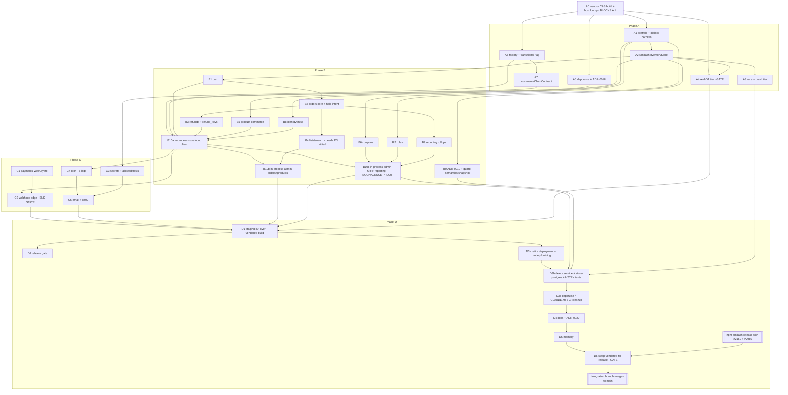

# Work order 02 — fold `@otta-sh/service` into the EmDash plugin, and delete it (v6)

- **Date:** 2026-09-13 (v6 — #2169 is merged upstream; the binding rebases onto it)
- **Status:** Ratified — **all three remaining USER DECISIONs were ratified 2026-09-13, as
  recommended:** **D1** accepted (the design binds `compareAndSet`'s create-if-absent semantics; the
  `put()` + unique-index workaround is not adopted), **D3** no data migration (staging is re-seeded),
  and **D3** the Orders list search narrows to a prefix-only `searchKey`.
- **Owner:** Otta maintainers
- **Supersedes:** v1–v5 — work order 02, same title. See "Changes from v5" at the end.
- **Supersedes/extends:** ADR-0002 (the merge it anticipated — and, at INC-D4, the split itself),
  ADR-0006 Decision 2 (one clause)

## Goal

Adopt EmDash's plugin-storage conditional-write API (`updateIf`, PR #2169 — **merged upstream**, so
it is simply part of `main`; `getVersioned` / `compareAndSet` / `compareAndDelete`, PR #2980 — still
open) and re-home commerce truth from the service's Postgres onto `ctx.storage`, so
`@otta-sh/plugin` owns inventory, cart, order, payment and reporting state in-process.

**End state: one deployable, one mode, no service.** The EmDash site Worker is the whole product.
`@otta-sh/service`, `@otta-sh/store-postgres`, `HttpCommerceClient`, the four admin HTTP clients, the
`commerce.mode` flag and the service's deployment are **deleted** in Phase D. Otta is pre-launch with
no users, so there is nothing to keep a second mode alive for, and a second mode that is never
exercised is a second mode that quietly rots.

The near-term goal is a `@otta-sh/store-emdash` adapter passing the domain's contract suites **now**,
against the **real** `PluginStorageRepository` from a locally built, vendored build of upstream
`main` — which already carries #2169 — with #2980 merged onto it. No reference implementation, no
waiting on upstream.

## Goals of removal (Phase D)

- **Delete `@otta-sh/service`** — the Hono app, its routes, its 40 test files (including the 8
  wire-contract suites), its wrangler config, its Node bin and its `wrangler deploy` script (there is
  no CI deploy job; deploys are manual `wrangler deploy` scripts).
- **Delete `@otta-sh/store-postgres`** — all 24 migrations, every `Kysely*Store`, the `./pg` and
  `./testing` subpaths, its 29 `*.dialects.test.ts` files and its 12 `*.pg.test.ts` race files (the
  race files having first been re-pointed at `store-emdash` in Phases A–B).
- **Delete the HTTP transport** — `HttpCommerceClient`, `admin-orders-client`,
  `admin-products-client`, `admin-rules-client`, `reporting-client`, their tests, and the
  `start-live-service.ts` harness.
- **Delete the mode machinery** — `__OTTA_COMMERCE_MODE__`, `resolveCommerceMode`,
  `__OTTA_COMMERCE_SERVICE_URL__`, `COMMERCE_SERVICE_BASE_URL` and the derivation of `ALLOWED_HOSTS`
  from it, and the `settings:serviceToken` / `settings:internalToken` kv keys and Settings-form
  fields.
- **Retire the staging service deployment** — the service Worker, its database binding, its managed
  Postgres.

## What stays

- **`@otta-sh/domain`** — every port, use-case, branded type, in-memory fake and contract suite.
  Unchanged. It is the spec, and it is what a future service would be re-derived from if one were
  ever wanted again.
- **`@otta-sh/payments-stripe` and `@otta-sh/payments-x402`** — used in-process, ported to WebCrypto
  in INC-C1.
- **The Postgres CI service container and `pnpm test:pg`** — T2 needs a real Postgres to run the 12
  race files against the real `PluginStorageRepository`. Deleting `store-postgres` does **not** mean
  deleting the Postgres integration job. See D7.

## Non-goals

- Changing any domain port signature, use-case, or wire format. Every port and every contract suite
  keeps its current shape; this work order adds adapters behind them and then removes one transport.
- Changing money representation (integer minor units, branded `Cents`), idempotency semantics, or
  order-snapshot immutability.
- Multi-tenant / third-party plugin hosting. ADR-0006's first-party restriction is unchanged and this
  work order widens trust further, so it binds harder.
- Migrating live merchant data (see D3) or publishing packages to npm (issue #44).
- Marketing claims about oversell in user-facing copy.
- **Any upstream engagement.** See Decision 0.
- **Wiring `updateIf` through EmDash's sandbox bridges.** Nothing to do: upstream `main` already
  wires it end to end (see the binding section, "What the build does and does not give us").
- **Keeping a non-EmDash deployment story.** That is the thing being given up, deliberately and
  explicitly (D5).

---

## Decision 0 — upstream posture and binding (ratified 2026-09-12)

**Otta does no upstream work of any kind.** No new upstream PRs, no pushes to any upstream branch, no
comments, reviews or design notes on the storage discussion (#632) or anywhere else upstream.

**#2169 is merged upstream.** `updateIf` is now simply part of the CMS's `main`, which collapses the
binding to a single-PR merge: the feature branch binds **upstream `main`, with #2980 merged onto it**,
vendored into the repo as tarballs. Not a reference implementation, not a prerelease, not an eventual
npm release — the real `packages/core` built from:

| Base / PR | State | Commit |
|---|---|---|
| **upstream `main`** — already carries #2169's predicate-guarded atomic `updateIf` | merged (#2169 merge commit `107c3ccd`) | `ea2ccd54` |
| **#2980** — revision-based conditional writes for storage and KV | open, non-draft | `c4b441b0` |

merged onto a single branch, **`otta/emdash-cas`**, built, packed, and committed under `vendor/`.
Full mechanics and the re-verification obligation are in "Binding: the vendored CAS build" below.

**No Otta work is blocked on upstream.** Every increment from INC-A0 onward runs today against the
real primitives.

**The integration branch merges to `main` only after** an npm `emdash` release carrying **#2980**
exists **and** the vendored build has been swapped for it (**INC-D6**). #2169 is merged, so it will be
in the next release regardless; #2980 is the only thing left to wait on.

**Accepted (ratified 2026-09-13):** the merge branch `otta/emdash-cas` is pushed to **Otta's own fork**
of the CMS repository — the `vedanshujain/emdash` remote — so the vendored build is reproducible by
anyone with the repo rather than only from a local clone. Pushing a branch to Otta's own fork is not
upstream engagement: no PR is opened, nothing is proposed, and nothing is visible to the upstream
maintainers as a request. `scripts/vendor-emdash.sh` plus the pinned base and #2980 head SHAs in
`vendor/README.md` remain the reproduction recipe either way.

---

## Binding: the vendored CAS build

The mechanics below were executed end-to-end and verified — but **on the pre-merge base**, when #2169
was still an open branch and the recipe merged two PR heads. #2169 has since merged upstream, so the
base has changed. **Every number and every claim in this section is therefore evidence from the old
base, and INC-A0 re-verifies all of it on the new one and records the new figures** (see INC-A0).

### The merge

**Base: upstream `main` at `ea2ccd54`, which already carries #2169's `updateIf`.** `packages/core` is
at version **0.37.0** there. Only **#2980** (head `c4b441b0`) is merged onto it, on branch
`otta/emdash-cas`.

**The only known conflict is the migration-number collision.** #2980 adds
`076_plugin_storage_revisions`; upstream `main` already ends at `076_collection_nav_group`.
**Resolution: renumber #2980's migration to `077_plugin_storage_revisions`** — the file rename plus
four `.ts` references plus the runner's map key. **Verify the free number at build time**: if upstream
`main` has since added further migrations, renumber to the next free number instead, and record the
number actually used in `vendor/README.md`. The two other conflicts the old two-head recipe hit (the
adjacent type-import lines in `repositories/plugin-storage.ts` and
`tests/integration/database/migrations.test.ts`) were artefacts of merging #2169's branch and may or
may not recur; resolve as "keep both" and "take #2980's `MIGRATION_NAMES.slice` form" if they do.

On the **old** base the merged tree built and passed its own suites: install 67s, core build 23s,
admin 19s, cloudflare 12s; **147/147** upstream tests green (`updateIf`, conditional storage,
no-oversell, migrations, units), and on real Postgres the upstream no-oversell race passed **78/78
across both dialects**. INC-A0 reproduces these on the new base and records the new numbers.

### Why tarballs, not a git dependency

**A pnpm git dependency with `&path:packages/core` does not work.** It fails with
`ERR_PNPM_WORKSPACE_PKG_NOT_FOUND` — the raw `package.json` in the repo still carries `workspace:*`
and `catalog:` specifiers, and `packages/core` has no `prepare` script, so it would not build even if
resolution succeeded. **Ruled out on evidence.**

**Committed tarballs work and are the recommendation.** `pnpm pack` three packages, versioned
**`<upstream core version>-otta.1`** before packing so they are not confusable with a real release.
Upstream `main` at `ea2ccd54` is at `0.37.0`, so the tarball version is **`0.37.1-otta.1`**; if the
base's version has moved by build time, derive the tarball version from it instead.

| Package | Size | Why |
|---|---|---|
| `emdash` | 3.9 MB | the primitives |
| `@emdash-cms/admin` | 5.0 MB | **required** — core's `dist` imports an unreleased `./portable-text-table` subpath that npm's 0.37.0 admin does not have |
| `@emdash-cms/cloudflare` | 245 KB | the Worker bridge |

**9.1 MB total in `vendor/`.** pnpm records sha512 integrity for each; `rm -rf node_modules &&
pnpm install --frozen-lockfile` reinstalls cleanly, so this is **CI-portable**. Every other sibling
dependency (`auth`, `gutenberg-to-portable-text`, `plugin-types@0.3.1`, `registry-client@0.5.0`,
`registry-lexicons@0.4.0`, `registry-verification@0.3.0`) matches npm exactly and resolves from the
registry.

### Overrides are required, and they must live in `pnpm-workspace.yaml`

npm's `@emdash-cms/cloudflare@0.37.0` carries an **exact** `"emdash": "0.37.0"` dependency. Without an
override, a second stock `emdash` appears in the store and **the Worker bridge uses the one without
the primitives**. With the override, exactly one `emdash@` exists in `.pnpm`.

**On pnpm 11.10, `pnpm.overrides` in `package.json` is silently ignored.** They go in
`pnpm-workspace.yaml`:

```yaml
overrides:
  emdash: "file:./vendor/emdash-0.37.1-otta.1.tgz"
  "@emdash-cms/admin": "file:./vendor/emdash-cms-admin-0.37.1-otta.1.tgz"
  "@emdash-cms/cloudflare": "file:./vendor/emdash-cms-cloudflare-0.37.1-otta.1.tgz"
```

Package manifests keep plain `"0.37.0"` specifiers, so the swap in INC-D6 is an override edit, not a
manifest sweep. Note also that `pnpm-workspace.yaml` carries a `minimumReleaseAgeExclude` list naming
the whole 0.31.1 train; `file:` dependencies bypass release-age checks, but that stale list is cleaned
up in the same PR.

### The rebuild recipe

Scripted as **`scripts/vendor-emdash.sh`**, ~2 minutes:

1. Fetch upstream `main` and the #2980 head.
2. Check out `otta/emdash-cas` from upstream `main`; merge the #2980 head; resolve the
   migration-number collision above (checking the next free number first).
3. `pnpm install --frozen-lockfile`.
4. Build `emdash`, `@emdash-cms/admin`, `@emdash-cms/cloudflare`.
5. Bump all three to `0.37.1-otta.1`.
6. `pnpm pack --pack-destination <repo>/vendor` ×3.

**Re-run whenever the base or #2980 moves.** `vendor/README.md` records the base `main` SHA, the
#2980 head SHA, the migration number actually used, and any conflict resolutions, so a reader can tell
exactly what is in the tarballs.

### Verified in a throwaway consumer — on the old base; INC-A0 re-verifies

- Migrations apply — 76 of them, tail `077_plugin_storage_revisions`.
- `updateIf` — `applied: true`, then `applied: false` when the guard fails.
- `getVersioned` — returns `{ value, revision }`.
- `compareAndSet` — ok, then `{ applied: false }` on a stale revision.
- `compareAndDelete` — stale revision → `false`.
- The vendored cloudflare `dist` carries `storageCompareAndSet` / `kvCompareAndSet` bridge wiring.

### What the build does and does not give us

**Re-checked on the new base: `updateIf` *is* wired through the sandbox bridge.** Upstream `main`
carries it end to end — `storageUpdateIf` on the bridge protocol
(`packages/cloudflare/src/sandbox/types.ts`), the host-side implementation
(`packages/cloudflare/src/sandbox/bridge.ts`) and the in-sandbox wrapper
(`packages/cloudflare/src/sandbox/wrapper.ts`), alongside the `context.ts` line for the trusted path.
#2980 wires its own conditional-write operations through the same bridge. So on this build a
**sandboxed** plugin has both `updateIf` and CAS, and the v5 claim that it had CAS but not `updateIf`
is stale.

This changes nothing Otta ships — Otta runs **trusted in-process** (ADR-0006), and Otta's own workerd
harness hand-builds `ctx` and never touches EmDash's bridge — but it does remove a standing gap. The
consequences for this document are:

- **T4's storage-backed sandbox suites bind `ctx.storage` in the harness to the real
  `PluginStorageRepository` over better-sqlite3** — the real implementation, injected by Otta rather
  than by the host bridge.
- **R8 is "the harness is not the real bridge."** The tier that observes the host is T3.
- If Otta ever needs `updateIf` under the real sandbox, **the host already provides it**; no Otta-side
  bridge work exists to plan.

### Migration-name risk

If upstream eventually lands #2980's migration under a number other than `077`, any database already
migrated by Otta's build carries a migration name upstream's runner does not know — and Kysely
requires a contiguous known prefix. **Staging is the only database that can hit this before the
swap**, and the remediation is a one-off rename in staging's migration table (demo data, re-seeded
anyway). Recorded as **R13** and as a checklist item in **INC-D6**.

---

## Branching and merge model

**Integration branch: `feat/in-process-commerce`, cut from `main`.**

- **Every increment is a PR into the integration branch**, not into `main`. Same conventions as
  always: one PR, one thing, branch `<type>/<slug>`, failing test first, the per-PR local targeted
  gate from D7, the area PR tag, **merge commits only**.
- **`main` is merged into the integration branch** after every merge to `main` that touches
  `packages/plugin`, `sites/staging`, `.dependency-cruiser.cjs`, or `adr/`. Do not let this
  accumulate — the branch lives for months and these are exactly the files it rewrites.
  **Named drift risk: PR #102, which is being closed.** It touches `manifest.ts`, `plugin.ts`,
  `types.ts`, `site-config.test.ts` and `adr/README.md`, re-adds a field widget (flipping the existing
  `fieldWidgets` assertion), adds a `content:write` capability, and collides on an ADR number — all
  five are files INC-A5/A6/C3/D1 rewrite. Closing it removes the drift and frees ADR-0018's number.

**Staging is deployable from the feature branch.** This is the point of vendoring rather than
waiting: **INC-D1 (the staging cut-over) happens on the vendored build**, subject to R13's
migration-name risk. Staging runs the feature branch; `main` does not.

**The integration branch merges to `main` only when all three hold:**

1. An npm `emdash` release carrying **#2980** exists. (#2169 is already merged upstream, so it will be
   in the next release regardless; #2980 is the only gate.)
2. **INC-D6** (swap the vendored build for the release) is complete and green.
3. The **full battery** plus **T3** are green on the released build.

That final merge is **one merge commit of the integration branch**, and its PR body carries the
full-battery summary (results and exit codes, not command lines, no environment identifiers).

**Rollback** inside the branch is "revert the merge commit". There is no rollback *to the service*
after INC-D3 — that is the point of D3, and it is why D3 comes after INC-D1 is smoke-green.

**INC-A5 and INC-A7 are behaviour-neutral** — a widened lint rule plus an ADR, and a test-only
extraction — so either could be taken to `main` directly to shrink the eventual integration diff.
**INC-A0 is not**: it changes the host pin for the whole repo.

---

## Decision record

### D1. Storage primitives and the adapter seam (ratified 2026-09-13)

**Recommendation.** Bind the *real* primitives from the vendored build, and keep one structural seam
so the binding can be swapped without touching the adapters.

1. **`@otta-sh/store-emdash`'s `src/` binds only a local structural `StorageAccess` interface** —
   `get`/`put`/`query`/`count`/`updateIf`/`compareAndSet`/`getVersioned`, plus `WhereClause`,
   `UpdateIfArgs`, `UpdateIfResult`, `NumericDelta`, `ConditionalWriteResult` and the
   `StorageSerializationError` shape. In production the plugin injects `ctx.storage`; in tests the
   harness injects a real `PluginStorageRepository`. The depcruise rule permits **`import type` from
   `emdash`** and forbids any runtime import, so the seam is enforced rather than trusted.
2. **There is no reference implementation and no conformance suite.** The vendored build's **own
   upstream suites are the conformance evidence** (147/147, including the Postgres no-oversell race at
   78/78), and **Otta's domain contract suites are the spec**. Maintaining a second implementation of
   semantics we can now execute would be pure drift surface.
3. **`PluginStorageRepository` is public from the root `emdash` entry.** Constructor
   `(db: Kysely<Database>, pluginId: string, collection: string, indexes: Array<string | string[]>)`,
   and it `implements StorageCollection<T>` — so a `Record<string, StorageCollection>` built from it
   is exactly what the host's internal `createStorageAccess` hands a plugin. Schema comes from
   `runMigrations(db)` exported by `emdash/db`; run the **full** set, because migration 077's `up()`
   is not individually exported.
4. **Postgres provisioning must run migrations, never hand-create tables.** Revisions are assigned by
   a plpgsql BEFORE-trigger using `gen_random_uuid()`, created by migration 077. A hand-built table
   has no trigger, so every `compareAndSet` would see an unchanging revision.

Two facts verified in the built code carry the design:

- `compareAndSet(id, null, v)` is a **real DB-level create-if-absent** —
  `insertInto(...).onConflict(oc => oc.columns(["plugin_id","collection","id"]).doNothing())
  .returning("revision")` — not a read-then-insert, so it is race-safe. `_plugin_storage`'s PRIMARY
  KEY is `(plugin_id, collection, id)`, which is what makes that conflict target correct.
- `compareAndSet` **returns the new revision** (`{ applied: true; revision: string } | { applied: false }`),
  so bounded CAS retry costs one round trip per attempt and needs no re-read on success. The revision
  is an opaque string.

**Why.** The structural port is what makes INC-D6 an override edit rather than an adapter rewrite, and
what lets the same adapter run against `ctx.storage` in production and a bare repository in tests.

**Cost.** The repo carries 9.1 MB of vendored tarballs until INC-D6, and a rebuild script that must be
re-run whenever either PR moves. Both are cheap and visible.

**Ratified 2026-09-13:** accepted — the design rests on `compareAndSet`'s create-if-absent semantics
surviving to the npm release, with no Otta-side workaround, and with the service deleted there is no
fallback transport either. The alternative primitive — `put()` plus a declared
`uniqueIndexes` constraint-violation catch — is **rejected on evidence**:
`syncDeclaredStorageIndexes` logs index failures and *never throws* (its own comment: "a missing index
affects query performance, not correctness, so it must not fail an install or a scheduler tick"), and
the failure is swallowed per index inside `createStorageIndexes`, including for `unique: true`. A
unique index that fails to materialize silently degrades once-only enforcement. That is not acceptable
for money. **That workaround is not adopted.**

**Rejected alternatives.**
- **A pnpm git dependency on the merge branch** — verified not to work
  (`ERR_PNPM_WORKSPACE_PKG_NOT_FOUND`; unresolved `workspace:*`/`catalog:` specs, no `prepare` script).
- **An in-repo reference implementation plus a ported conformance suite** — obsolete now that the real
  build is consumable, and a permanent drift surface.
- **Vendoring `PluginStorageRepository`'s source into Otta** — forks the semantics we are converging
  on; the tarball is a build of upstream's code, not a fork of it.
- **Waiting for an npm release before starting** — the thing the vendoring exists to avoid.

---

### D2. All-or-nothing without `batch`

**Recommendation.** One rule, applied per coupling:

> **An invariant that spans two facts lives in ONE storage document. A coupling that spans two
> aggregates is made idempotently completable by any replayer, and swept.**

Concretely: **aggregate-per-document (option a) is the default; intent-claim + deterministic
completion (option b) covers genuine cross-aggregate edges.**

The mechanics are a two-tier write strategy:

- **`updateIf` is the lock-free fast path** for contended pure-counter writes (guard and arithmetic in
  one statement, no read, no retry). `where: { onHand: { gte: q } }, delta: { onHand: { dec: q } }` is
  exactly today's `WHERE on_hand >= qty`.
- **`compareAndSet(id, rev, nextDoc)` is the general read-modify-write CAS** for everything
  multi-field, with bounded jittered retry. This is what replaces a transaction: arbitrary multi-field
  invariants, computed in JS, committed atomically against one row. Retry is read → compute → CAS → on
  `{applied:false}` re-read.

**Reserve is a `compareAndSet` read-modify-write, permanently.** `updateIf` alone cannot carry reserve,
because the reservation's hold must be recorded in the same write as the decrement and the hold lives
at a nested path. Nested-path `updateIf` would collapse reserve back to one lock-free statement — but
under Decision 0 Otta is not asking upstream for it, so **that is not a planned state.** The interim
answer is the permanent one: bounded jittered retry, a documented ceiling, a typed retryable error,
and measurement (R2).

#### Per coupling

Each row cites the `Kysely*Store` statement it replaces. **Those implementations are deleted at
INC-D3**, so **INC-B0 / ADR-0019 must snapshot the guard semantics in prose** before they go — see
the sequencing note.

| Coupling (today) | Recommendation | Invariant preserved by | Proven by |
|---|---|---|---|
| `#finalize` — reservation `pending→held` **+** guarded inventory decrement (`kysely-inventory-store.ts:712-745`) | **(a) Embed.** `inventory/{sku}` holds `onHand` plus a map of *live* holds keyed by the reserve idempotency key, **plus a derived `reservation_index/{reservationId}` document** (see below — without it six port methods are unanswerable). Reserve is one `compareAndSet` on one row, so no oversell and once-only are the *same* atom. | no oversell; idempotency once-only; **the crash window between claim and finalize disappears** | `inventoryStoreContract` (fake/sqlite/pg/D1) + `no-oversell.pg.test.ts` (M=5, N=50, 20 loops) + `adjust-concurrency` + `restock-concurrency` |
| **`adopt` / `adoptMany` / `commitMany` / `releaseAdopted` — one order's holds spanning N SKUs** (`kysely-inventory-store.ts:223,258,309,189`) | **(b) Intent-claim.** These take reservation ids with **no sku**, and today each is ONE guarded `UPDATE … WHERE id IN (:ids)`. Under per-SKU documents they become N writes across N documents, which is not atomic. The order document records the `holdsAdopted` / `holdsCommitted` **intent** before any per-SKU write; each per-SKU write is idempotent by reservation id; a **sweeper completes a partial set from the order's intent**. Reservation id → sku comes from `reservation_index`. | a paid order never has a hold left un-committed and then reaped by the Phase-3 sweep | `inventoryStoreContract`'s `adoptMany`/`commitMany` cases (incl. the unknown-id asymmetry: `commitMany` **throws**, `adoptMany` returns `lost`) + `no-oversell-checkout-multiline.pg.test.ts` (3 SKUs) + a new partial-commit crash case |
| `#flipAndEnqueue` — guarded order flip **+** append-only `order_events` **+** `order_emails_outbox` upsert (`kysely-order-store.ts:1002-1065`) | **(a) Embed.** The order document carries `state`, `events[]`, `emailOutbox[]`. One `compareAndSet` guarded on `rev` and `state === from`. "Flipped but no event" becomes structurally unreachable, as today. | transition once-only; audit completeness; outbox exactly-once per `(orderId, toState)` | `order-transition-contract`, `order-timeline-contract`, `outbox-dispatch.dialects.test.ts` |
| `createFromCart` — `orders` insert `ON CONFLICT DO NOTHING` **+** multi-row `order_items` **+** `order_totals` **+** `order_shipping_address` (`kysely-order-store.ts:99-193`) | **(a) Embed** header + items + totals + address in one document, created by a single create-if-absent. **Snapshot immutability becomes structural**: items are written only by the creating write, and `OrderDoc.items` is `readonly`. Plus **(b)** for the key→id link: `order_keys/{idempotencyKey}` is claimed first and carries the full intent (orderId + payload), so any replayer can deterministically finish the create; the create itself is create-if-absent on `orderId`, hence idempotent. | replay once-only; order snapshot immutability (price + title frozen at purchase) | `order-store-contract`, `order-flow.dialects.test.ts`, the existing "editing a product never rewrites an order line" case |
| Refund `reserveRefund`/`finalizeRefund` + ceiling `min(Σcaptured, frozen total)` computed under a portable row lock (`kysely-order-store.ts:382`, `:560`) | **(a) Embed** `payments[]` and `refunds[]` inside the order document, **plus `refund_keys/{refundIdempotencyKey} → { orderId }`**: the settle path today finds the order by the refund key alone (`updateTable("refunds").where("idempotency_key", …)` then reads `order_id`), and an embedded array cannot be looked up by that key without a scan. The ceiling is computed *inside* the read-modify-write and committed by the same `compareAndSet`. | refund ceiling never exceeded; refund idempotency once-only | `refund-order-contract`, `refund-race.pg.test.ts` |
| `#carrySkuStock` — sku rename, two inventory rows locked in sorted order (`kysely-product-commerce-store.ts:409-473`) | **(b) Intent-claim.** One `compareAndSet` on the source doc sets `onHand → 0` *and* `transferOut: { token, toSku, qty }` — and the "refuse if the source has a `held`/`adopted` reservation" check (`SkuHeldStockError`) is now a read of the *same document*, so that guard also becomes structural. Then the target doc applies the transfer iff `appliedTransfers` lacks `token` (bounded ring). Then the source clears `transferOut`. Any replayer or the sweeper completes it. | stock conservation across rename; `SkuHeldStockError`; idempotent replay | `sku-rename-ledger.dialects.test.ts`, `sku-rename-race.pg.test.ts`, `variant-sku-rename-race.pg.test.ts` |
| Cart `expireHold` — deadline re-check + stock return + line delete in one tx (`kysely-cart-store.ts:327-368`) | **(b) Intent-claim.** Guarded flip of the cart line to `expiring` (once-only token) → release the reservation (idempotent by its own state machine) → remove the line. Sweeper completes a partial. Today's fixed lock order becomes a fixed *step* order. | hold expiry returns stock exactly once | `hold-expiry.dialects.test.ts`, `cart-fence.dialects.test.ts`, `no-oversell-cart.pg.test.ts` |
| Coupon no-over-redeem — `uses_count+1 WHERE max_uses IS NULL OR uses_count < max_uses` (`kysely-coupon-store.ts:211-219`) | **(a)** single-row already. Split the `OR` into two client-side branches (`updateIf` with `where: { usesCount: { lt: max } }` when capped; unguarded `delta` when uncapped — an uncapped coupon has no invariant to violate). Per-customer cap keeps today's after-the-lock semantics in a `coupon_redemptions/{couponId}:{customerId}` counter doc. | `CouponExhaustedError` ceiling | `coupon-lifecycle.dialects.test.ts`, `coupon-no-over-redeem.pg.test.ts` |

#### The replay ordering rule (this is atomicity, not bookkeeping)

Terminal reserve outcomes are copied to `reservation_outcomes/{key}` so a replay can be answered after
the live hold is pruned. **That copy's ordering is load-bearing.**

> The terminal outcome is written to `reservation_outcomes/{key}` **before** the hold is pruned from
> the inventory document; the prune is the second, idempotent step and is swept. A hold may therefore
> be observed both live and terminal, and the replay path must read `reservation_outcomes` first and
> treat a live hold as authoritative only in its absence.

The failure this prevents: prune first, crash, replay finds neither an outcome document nor a live
hold, concludes the key is fresh, and **decrements a second time**. That is a once-only violation on
the money path.

**Why.** Single-row primitives cannot give cross-row atomicity — that is a law, not a gap. The only two
honest moves are "make it one row" and "make the second step idempotently completable". The decisive
constraint is that **an inventory decrement is not idempotent unless the inventory row records who
applied it**, which forces the holds map into the inventory document; once that is accepted, the same
aggregate discipline resolves orders, refunds and carts for free.

**Cost.**
- **Write amplification.** `_plugin_storage` is a single JSON column, so a `compareAndSet` rewrites the
  whole document. Order documents grow with items + events + refunds; budget a cap and watch D1's
  row/value limits (R3).
- **Contention, with no structural fix in this plan.** CAS on a hot SKU's inventory document can
  retry-storm under a flash sale, where today's single guarded `UPDATE` degrades gracefully. Under
  Decision 0 there is no nested-path follow-up, so **measurement plus a bounded jittered retry with a
  documented attempt ceiling is the answer, not an interim** (R2).
- **Retry exhaustion has no `ReserveResult` member.** `ReserveResult` is
  `{ok:true,reservationId} | {ok:false,reason:"OUT_OF_STOCK"}`. An exhausted retry budget must surface
  as a **typed, retryable error distinct from `OUT_OF_STOCK`** — a shopper who could have bought must
  never be told "out of stock" — mapped to **503** at the HTTP boundary and to a retry in the cart
  route. The ceiling and the mapping are decided in **INC-A2**.
- **Row-size discipline.** Live holds must be pruned on commit/release/expire (after the outcome copy),
  and `appliedTransfers` must be a bounded ring.
- **No host-side transactions anywhere**, which is a feature: `40P01` (lock-order deadlock, the SQLSTATE
  `updateIf` maps to `StorageSerializationError`) is unreachable by construction. `40001` retry is still
  wired for above-READ-COMMITTED hosts.

**Rejected alternatives.**
- **A two-step whose second step is not itself atomic.** A `pending` reservation cannot tell
  crash-before-decrement from crash-after **unless the inventory row records the applying reservation
  id**. Recording it is what forces the holds map into the inventory document; once recorded, the
  two-step and the embedded aggregate are the same design, and we choose the single-document form
  because it needs no heal sweep. (Production reserve *is* a two-step — an idempotency claim then a
  finalize — with a heal path the contract pins, `inventory-store-contract.ts:273`. What makes it safe
  is that step 2 is atomic, not that there is no step 1.)
- A multi-row atomic batch — not in either PR, and Decision 0 forbids asking for one.
- Host-side multi-`updateIf` transactions — reintroduces `40P01` and is unavailable on D1 anyway.
- Keeping any coupling on the service — the service is being deleted (D5).

---

### D3. Data home (both decisions ratified 2026-09-13: no migration; prefix-only Orders search)

**Recommendation — collection layout: one collection per aggregate, one per ledger that has no
aggregate, plus the two lookup collections the port signatures force.** Declared on the descriptor's
`storage` field, which is honoured for a trusted in-process `format: "standard"` plugin with **no
format or trust gate anywhere** — `adaptSandboxEntry` builds the storage config straight from
`descriptor.storage`, and `createContext` branches only on `capabilities`.

| Collection | Doc id | Contents | Declared indexes (see the read-contract rule) |
|---|---|---|---|
| `inventory` | `sku` | `onHand`, live `holds` map, `transferOut`, `appliedTransfers` ring | — (id lookup only) |
| **`reservation_index`** | **reservationId** | **`{ sku }` — the reverse lookup six port methods require** | — |
| `reservation_outcomes` | reserve idempotency key | terminal replay answer | — |
| `inventory_movements` | movement idempotency key | restock/removeStock ledger claim | `sku`, `createdAt` |
| `carts` | cartId | lines, state, hold deadline, embedded mutation-key map | `state`, `holdExpiresAt` |
| `orders` | orderId | header, `items[]` (readonly snapshot), totals, address, `events[]`, `emailOutbox[]`, `payments[]`, `refunds[]`, `notes[]`, reconciliation, hold-adoption/commit intent | `state`, `createdAt`, `customerId`, `searchKey`, `[state, createdAt]`, `emailDueAt` |
| `order_keys` | order idempotency key | intent claim → orderId | — |
| **`refund_keys`** | **refund idempotency key** | **`{ orderId }` — the settle path's only handle** | — |
| `order_sku_index` | `${sku}:${orderId}` | derived, for search-by-SKU | `sku` |
| `product_commerce` | productId | commerce fields + embedded `variants` map | `sku`, `active`, `taxClass`, `titleLower` |
| `sku_owners` | sku | → productId (sku uniqueness claim) | — |
| `coupons` / `coupon_redemptions` | code / `${couponId}:${customerId}` | counters | `active` |
| `customers` / `customer_emails` / `sessions` | customerId / email / token hash | addresses embedded in the customer doc | `emailLower` |
| `entitlements` | grant idempotency key | + a lookup doc per `(customer, scope)` | `customerId`, `scope` |
| `payment_events` | dedupe key | — | — |
| `shipping_zones` / `tax_classes` | zoneId / classId | methods+rates / rates embedded | — |
| `settings` / `settings_mutations` | `"store"` / mutation key | — | — |
| `reporting_daily` | `${currency}:${YYYY-MM-DD}` | precomputed counters | `currency`, `date` |

**Why `reservation_index` and `refund_keys` are not optional.** `commit`, `release`, `adjust`,
`releaseAdopted`, `adoptMany` and `commitMany` all take reservation ids **with no sku**
(`packages/domain/src/ports/inventory-store.ts:33-126`); with holds embedded per SKU there is no way to
find the document. The contract also pins two *different* unknown-id behaviours —
`commitMany(["no-such-reservation"])` must **throw** `ReservationNotFoundError`
(`inventory-store-contract.ts:653`) while `adoptMany` must fold an unknown id into `lost` and never
throw (`:600`) — and "unknown" is only provable against an index. The index document is written
**before** the hold, so an id absent from it is provably unknown. `refund_keys` is the same shape for
the refund settle path.

**Idempotency: ledgers become doc-id (PK) idempotency, not unique indexes.** The doc id *is* the
once-only guard via create-if-absent — enforced at the DB level by `_plugin_storage`'s PRIMARY KEY on
`(plugin_id, collection, id)` and `compareAndSet(id, null, v)`'s `INSERT … ON CONFLICT DO NOTHING`.
Four ledgers (`cart_mutations`, `coupon_redemptions`, `order_notes`, per-order events) collapse
*inside* their aggregate document. `uniqueIndexes` are declared only where a natural key must be
unique and is not the doc id (`sku_owners`, `customer_emails`) — and in both cases the claim document
itself, not the index, is the enforcement.

#### The index rule — declaration is a read contract; materialization is not correctness

A declared index is **required** to query or order by a field: `validateWhereClause` throws
`StorageQueryError("Cannot query on non-indexed field '<f>'.")` and `validateOrderByClause` throws the
equivalent for ordering, both called on every `query()` and `count()`. An undeclared field is not slow
— it is a runtime throw. So the D3 index lists are part of the **read contract** and
`site-config.test.ts` must pin them exactly. In tests the same list is the `indexes` argument to
`PluginStorageRepository`'s constructor, so a collection's declared indexes and its test harness cannot
silently disagree.

What is *not* a correctness guarantee is **materialization**: `syncDeclaredStorageIndexes` logs
per-index failures and never throws, including for `unique: true`, so a unique index that fails to
create degrades silently. Hence: **declare every queried field; never let a unique index be the
once-only enforcement.**

**Index materialization timing** is settled: configured (hand-registered) plugins have no install
handler, so `syncPluginStorageIndexesOnce()` on the scheduler tick is their sync moment — and
`sites/staging/wrangler.jsonc:62` already declares `crons: ["* * * * *"]`, so indexes appear within a
minute of deploy. Note it is guarded to run **once per process**, not every tick.

#### What `ctx.storage` can serve

`query({ where, orderBy, limit, cursor })` and `count(where)`. `orderBy` is
`Record<string, "asc"|"desc">`, multi-field, and requires **one shared direction** when a cursor is
used; an id tiebreak is appended automatically. **`limit` is clamped to 100**
(`Math.min(limit ?? 50, 100)`) — the code comment in the public type saying 1000 is stale.
`WhereClause` supports exact match, `null` → `IS NULL`, `in`, `startsWith` (LIKE-escaped), and
`gt/gte/lt/lte`. It has **no `contains`, no `ne`, and no OR** — it is a flat record joined with `AND`
only.

#### What it genuinely cannot serve, and the fix

**1. The Orders list search — it is an OR of three arms, not a substring problem. Ratified
2026-09-13: prefix-only `searchKey`.**

`listOrders`' search predicate is an id-prefix arm **OR** a folded buyer_ref substring arm **OR** an
exact-lower sku arm expressed as a correlated `EXISTS`
(`packages/domain/src/ports/order-store.ts:560-640`). The port doc states why the sku arm is `EXISTS`
and never a join: *"the list's contract is one row per order… a join would return it twice, inflate
the `limit + 1` next-page probe, and make `countOrders` (which shares this predicate) over-count."*
`WhereClause` is AND-only and cursors are per-query and opaque, so **"issue two queries and merge under
a stable sort" is not available** — it cannot produce a correct `nextCursor` and it cannot produce a
correct `countOrders`.

The only sound option remaining is **denormalize all three arms into one indexed `searchKey` field**
with **prefix-only** semantics. This is a user-visible narrowing on **two** axes: buyer_ref stops
matching mid-string (searching `"@example.com"` finds nothing) *and* the composite key changes what a
partial id or sku matches. v4 offered "keep the Orders list on the service" as the alternative; **with
the service deleted (D5) that option no longer exists**, which raises the stakes on this ratification
rather than lowering them.

**The `searchKey` denormalization was ratified 2026-09-13**, with the narrowing documented in the
screen's empty state. Widening the domain port instead — the only other move — was not taken, and
would be a separate change with its own PR if it is ever wanted.

**2. Correlated existence (search by line SKU).** → `order_sku_index` documents, written after order
creation, derived and idempotent (so no atomicity needed), healed by the sweeper. Feeds `searchKey`.

**3. Keyset pagination maps in shape but not in token.** `OrderListCursor` is a value position
`{createdAt, id}` that the plugin route mints for the wire (`order-store.ts:704-707`). The host cursor
is an **opaque host-minted string** whose encoder is internal and whose seek re-reads the cursor row
from the database by id. So: `listOrders` is keyset, which is the right shape, but the adapter must
either round-trip the host cursor through the route's opaque token or re-derive the position; decide
which in INC-B4, and note that a **deleted cursor row is a paging fault with no analogue today**.

**4. Aggregates — reporting is not "inc a counter".** `revenueByPeriod(range, interval)` buckets on
`orders.created_at` but counts only orders whose **current** state is in `REVENUE_COUNTING_STATES`,
and each bucket also carries `refundedCents` as a union with revenue
(`packages/domain/src/ports/reporting-store.ts:17-34`). `ordersByStatus(range)` is a **current-state**
count over a created-at window with no allow-list (`:36-41`). `ReportInterval` is
`"day" | "week" | "month"`. The honest consequences:

- A rollup is keyed on the order's **creation** day, not the transition day. A transition on an order
  created three months ago must **decrement one counter and increment another in a past bucket**.
- A **partial refund is not a state transition** yet must roll up, so the rollup write is not driven by
  transitions alone.
- `ordersByStatus` requires a **move-between-state-buckets** on every transition.
- The rollup document is a **different aggregate from the order**, so D2's two-aggregate rule applies:
  the rollup write must be idempotent per `(orderId, transition)` **and swept** — a **reporting-heal
  sweeper** is required (INC-C4).
- Reads sum day documents at `limit` 100 per page, so a one-year window is **four pages**, not one.

**5. Raw SQL / host DB handle** — never available to a plugin. Nothing in the plan needs it.

**Data migration: none. Ratified 2026-09-13.** Staging's commerce data is demo data with an existing
re-seed script (`sites/staging/scripts/seed-demo-commerce.ts`), nothing is published to npm, and there
is no live merchant. Staging is **re-seeded** at cut-over and its order history is discarded. This also
makes R13's migration-name remediation trivial. The rejected fallback — a one-shot
`@otta-sh/store-emdash/migrate` reading Postgres through the existing Kysely stores and writing
documents through the new adapters — is **not built**, and with the decision ratified there is no
longer a deadline hanging over INC-D3b.

**Cost.** ~22 collections to declare and keep in sync with the descriptor; the index lists become part
of the read contract and must be pinned; the search narrowing above; reporting becomes write-time work
with a heal sweeper instead of read-time work.

**Rejected alternatives.** One mega-collection with a `type` discriminator (defeats per-collection
indexes, guarantees hot-row contention). Mirroring the Postgres tables one-to-one as collections
(recreates every cross-row coupling `updateIf` cannot express).

---

### D4. Plugin boundary rules

**Recommendation.**

1. **Amend `plugin-is-sandbox-clean`** (`.dependency-cruiser.cjs:21-54`) to admit `@otta-sh/domain`
   and `packages/store-emdash/`. **Read against the file as it stands, the shape is this:** the rule's
   single `to.path` alternation already names **both** `domain` and `admin-react` in **all three**
   `@otta-sh` clauses — `node_modules/@otta-sh/(domain|admin-react)`, the bare specifier
   `^@otta-sh/(domain|admin-react)`, and `^packages/(store-[^/]+|service|payments-[^/]+|domain|admin-react)/`
   — so the edit is to **drop `domain` from all three** (admitting the domain) while **keeping
   `admin-react` in all three** (the one-hop escape from the console quarantine stays banned). Separately,
   `store-[^/]+` in the third clause must become an explicit list or a negative lookahead, because as
   written it swallows `store-emdash` along with `store-postgres`. Everything else stays exactly as-is for now: `pg`, `pg-pool`, `kysely`,
   `better-sqlite3`, `workerd`, `hono`, `undici`, `node-fetch`, `axios`, `ws`, the
   `^(node:)?(fs|child_process|net|http|https|os|dgram|dns|tls|worker_threads|cluster|vm)` builtin
   half (note the deliberate optional-`node:` form the rule's own comment explains),
   `@otta-sh/admin-react` (the one-hop escape from the console quarantine), and
   `packages/(service|store-postgres|payments-*)`. **At INC-D3c the `service` and `store-postgres`
   clauses are removed** — not because the ban is relaxed, but because the packages no longer exist
   and a rule naming a non-existent path is a rule nobody can test. The same applies to
   `console-imports-no-workspace-package`.
2. **The premise that makes this safe is `domain-is-io-free`, which is unchanged — and verified:**
   `@otta-sh/domain` has **zero runtime dependencies** and **zero `node:` imports** anywhere in
   `packages/domain/src`. Say this in the ADR: the boundary was never "the plugin must not know the
   domain", it was "the plugin must not acquire IO"; the domain was forbidden as a cheap proxy for
   that, and the proxy is now costing more than it buys.
3. **New rule `store-emdash-is-sandbox-clean`** over `^packages/store-emdash/src`: the same forbidden
   list, **plus** a runtime import of `emdash` / `@emdash-cms/*`. `import type` from `emdash` is
   **permitted** — the package may name the host's types, it may never execute the host's code. The
   structural `StorageAccess` interface stays the seam (D1).
4. **New packages / modules.**
   - `@otta-sh/store-emdash` (`[Adapters]`) — every `Emdash*Store`, the `StorageAccess` port, the
     in-process **`IdGen` (`crypto.randomUUID()`) and `Clock`** implementations (the existing concrete
     `IdGen` lives in `packages/store-postgres/src/id-gen.ts` and is deleted with that package at
     INC-D3b, so `store-emdash`'s copy becomes the only one), and (test-only) the dialect harness that
     constructs real `PluginStorageRepository` instances.
   - `packages/plugin/src/commerce/in-process-commerce-client.ts` (`[Plugin]`) — implements the
     existing plugin-local `CommerceClient` by constructing domain use-cases over `store-emdash`
     adapters bound to `ctx.storage`. It lives in the plugin because it is the *transport* adapter and
     must hold `ctx`. **After INC-D3b it is the only implementation**, and the `CommerceClient`
     interface can be collapsed into it if review prefers.
   - `packages/plugin/src/commerce/make-commerce-client.ts` — the composition root (D6). Transitional:
     it exists to keep the HTTP tier green while adapters land, and its mode branch is deleted at
     INC-D3b.
5. **Descriptor changes** (`sites/staging/src/otta-plugin-descriptor.ts`): gains `storage: { …
   collections with indexes/uniqueIndexes… }`. **Capabilities stay exactly
   `["content:read", "network:request"]`** — `ctx.storage` is built under an explicit "always
   available" path with no capability gate, and `ctx.cron` is likewise ungated (gated only on the
   runtime having cron wired). There is no `storage` or `cron` capability string in the vocabulary at
   all. `allowedHosts` becomes the Stripe API host, the email API host and the x402 facilitator host
   (D5); the commerce-service hostname goes away entirely at INC-D3a.
6. **`sites/staging/test/site-config.test.ts` changes**: the
   `expect(descriptor.storage).toBeUndefined()` case flips to asserting the **exact** declared
   collection set and index list (now a read contract, per D3); the capabilities case keeps asserting
   capabilities are exactly the manifest's and is left alone; the **separate** `allowedHosts` case
   asserts the new set exactly; the `format: "standard"` / no-`adminEntry` / no-`componentsEntry` case
   is untouched and must stay untouched.
7. **ADRs.** New **ADR-0018** (next free number — `adr/` ends at 0017) supersedes **ADR-0006 Decision
   2's "no direct DB/storage access" clause and only that clause**. ADR-0006 Decision 1 — the workerd
   sandbox suites as the contract gate — is **reaffirmed and becomes more load-bearing**. Every other
   ADR-0006 prohibition stands unamended, including **"zero EmDash dependency"** for
   `packages/plugin`, which survives because `ctx` is injected and `packages/plugin/src` imports
   nothing from the host. `packages/store-emdash/src` narrows that to "zero EmDash *runtime*
   dependency", and ADR-0018 must say so explicitly rather than leave the `import type` allowance
   implicit.

**Why.** The depcruise rule was a proxy for "no IO in the sandbox perimeter". The domain is IO-free by
construction and separately enforced, so the proxy now blocks the exact thing ADR-0002 designed for.
Nothing about the *capability* posture changes.

**Cost.** The plugin's hand-mirrored wire types in `packages/plugin/src/types.ts` lose their reason to
exist once the HTTP transport is deleted — INC-D3b should either delete them in favour of domain types
or keep them deliberately as the admin route's response shapes, and the ADR must say which. Plugin
bundle size grows by the domain + adapters + payments (R6).

**Rejected alternatives.** Keep the ban and re-export the domain through a shim package (ceremony that
fools the rule without changing the risk). Move the in-process client into a new package outside the
plugin (it needs `ctx`; it *is* plugin code). Grant a `storage:*` capability (none exists). Forbid
`import type` from `emdash` in `store-emdash` (would force a hand-mirrored copy of `Kysely<Database>`
and the repository's constructor types — drift for no safety; a type import emits no code).

---

### D5. What cannot fold in, and the end-state topology

**Verified finding: an EmDash plugin route cannot receive raw bytes, in either mode — but for two
different reasons.** `parseRouteInput` (`packages/core/src/plugins/routes.ts:103-120`) calls
`request.json()` for any POST/PUT/PATCH, gated on HTTP method alone — no schema check, no content-type
check, no opt-out — and it runs on the host in **both** modes, before dispatch. Then: in **trusted**
mode `guardConsumedRequestBody` (`routes.ts:36-52`, referenced exactly once, at `:238`, inside the
trusted-only `PluginRouteHandler.invoke`) replaces
`json`/`text`/`arrayBuffer`/`blob`/`formData`/`bytes` on `ctx.request` with a throw; in **sandboxed**
mode there is no `Request` object at all — the handler receives a `SerializedRequest` plain object
carrying no body. Either way the raw bytes are gone before the handler runs. Stripe signs the exact
byte sequence, and re-serializing parsed JSON does not reproduce it. `PluginRoute` has no `rawBody`,
`parseBody` or `input: false` option — including on the vendored build.

**Under Decision 0, Otta will not be proposing one.** So: **the Stripe webhook is a site-owned
endpoint, permanently.** That is the end-state shape, not an interim one.

*(Noted for the record, actionable only if upstream adds it unprompted: `clone` is **not** in the
guard's method set, so `ctx.request.clone()` returns an unguarded `Request`. It is inert for POST
because the stream is already read.)*

**Recommendation per item:**

| Item | Recommendation |
|---|---|
| **Inbound Stripe webhook** | **A site-owned Astro endpoint — `sites/staging/src/pages/api/webhooks/stripe.ts` — is the END STATE.** It reads raw bytes (verified: EmDash's middleware never reads an incoming request body, and plugin routes are reachable only through its own injected catch-all, so a site route under `src/pages/api/**` gets a raw, unconsumed `Request`), verifies the HMAC, and dispatches to the plugin via **`context.locals.emdash.handlePluginApiRoute(pluginId, method, path, request, caller)`** — the same entry point EmDash's own catch-all uses, available on the authenticated middleware path. **The settle route must be non-public and the endpoint must supply an internal caller identity:** a `public: true` settle route is also reachable directly at EmDash's catch-all, which is a forged-webhook bypass of the HMAC check we just performed. Because this is permanent, ship the endpoint as a **documented, copy-pasteable, tested file**: a second site is a copy, not a design exercise. |
| **Outbound Stripe + the API secret** | `ctx.http.fetch` with the Stripe API host in `allowedHosts`; the secret uses the **existing write-only `ctx.kv` masked-secret pattern** already proven by the service-token and internal-token settings — never rendered back into a block. (Those two token fields are themselves deleted at INC-D3a; the *pattern* is what is reused.) The **webhook signing secret** is read by the site endpoint, not the plugin, so it stays a Worker secret binding; name this asymmetry rather than hiding it. |
| **`*/15` cron** | Folds in. `ctx.cron` is **always available, no capability** — no `storage` or `cron` string exists in the capability vocabulary, and the only gate is whether the runtime wired cron at all. The `cron` hook fires for **configured** (hand-registered) plugins on the scheduled event. `sites/staging/wrangler.jsonc:62` already declares `crons: ["* * * * *"]`. The service's four `scheduled()` legs (`expireHolds`, `expireOrders`, `dispatchOrderEmails`, `pruneChallenges`) move into the plugin's cron hook, plus **five** new sweepers (sku-transfer completion, `order_sku_index` heal, **partial adopt/commit completion (D2)**, **reporting rollup heal (D3 item 4)**, and — per the ratified INC-C4 brief amendment recorded in the run log — **release of claimed-but-unapplied coupon redemptions**, which frees the per-customer slot a dead checkout left spent; the plan as first written listed no coupon sweeper, and ADR-0019 says a missing sweeper is a correctness bug). **Correction to the sentence above:** the `cron` hook fires for a configured (hand-registered) plugin only once a TASK ROW exists — the executor invokes the hook per due row, and `plugin:activate` (the host's own registration moment) fires only from an admin enable. So the plugin registers its task from a path that a configured deployment actually reaches, not from activation alone. |
| **Email dispatch** | Keep the HTTP sender through `ctx.http` + `allowedHosts` — it preserves the `EmailSender` port and the existing adapter and needs **no new capability**. Rejected: `ctx.email`, which requires the `email:send` capability *and* a host-configured provider. |
| **x402** | Folds in entirely. `refundable = false` unchanged; the facilitator host joins `allowedHosts`; settlement already runs through a plugin-initiated call. |
| **`payments-stripe` / `payments-x402`** | **Both packages stay** — they are used in-process. Both use `node:crypto` (`createHmac` + `timingSafeEqual`), which the sandbox-clean rule bans. **Port both to WebCrypto** (`crypto.subtle.importKey`/`sign`, constant-time compare) — INC-C1. They keep their hand-rolled HTTP (no SDK) and their Stripe idempotency header. The site webhook endpoint imports the ported HMAC verifier, which is a new `sites/staging → packages/payments-stripe` edge with no depcruise rule today — and, being the end state, one worth a rule. |

**End-state topology: one deployable — the EmDash site Worker — with a thin site-owned webhook edge
for raw-body inbound.** There is no second mode and no second package to deploy.

**ADR-0002's five reasons a service may remain — all explicitly rejected, for now:**

1. *Payment-secret / PCI isolation* — **rejected.** The Stripe secret lives in the same Worker as the
   CMS, with the same blast radius as the CMS's own secrets. Acceptable first-party and pre-launch.
   Otta never stores card data (Stripe Elements in the buyer's browser, ADR-0012), so this is key
   isolation, not cardholder-data isolation.
2. *Stable public webhook URLs* — **rejected as a reason.** The site's own domain serves a stable path.
3. *Independent scaling* — **rejected as a reason.** Workers scale per request either way; the real
   ceiling is **D1's write throughput**, which is materially below Postgres. With no users, that
   ceiling is theoretical. If it ever becomes real it is a re-derivation problem, not a
   keep-a-spare-mode problem (see below).
4. *Serving non-EmDash storefronts* — **rejected.** There is no non-EmDash storefront and no user
   asking for one. This is the reason being genuinely given up.
5. *A merged plugin pins truth to D1* — **accepted as the price**, not as a reason to keep a service.

**How a service would come back, if it ever needed to.** Not by keeping one on standby — an unexercised
mode rots, and a rotting mode is worse than no mode. It would be **re-derived from the domain ports**,
which are unchanged by this work order and stay unchanged: `@otta-sh/domain` keeps every port,
use-case, branded type, in-memory fake and contract suite. A new transport over those ports is a known,
bounded piece of work whose acceptance criteria already exist in the repo. **ADR-0020 must say this
explicitly** so a future reader does not mistake the deletion for a lost capability.

**Ratified:** (i) the Stripe API key lives in the site Worker's plugin kv; (ii) the site-owned webhook
endpoint with a non-public settle route is the permanent shape; (iii) **the service,
`store-postgres`, `HttpCommerceClient` and the four admin HTTP clients are deleted in Phase D.**

**Rejected alternatives.** Re-serialize the parsed webhook body and verify against that (signature
verification on non-identical bytes — unsafe). Put the webhook on a second Worker (defeats "one
deployable"). Patch the route parser on the merge branch (Otta would then own a host behaviour no
release will ever carry, and INC-D6 would silently remove it).

---

### D6. Cut-over, and the transitional flag

**Recommendation.** One factory and one build-time flag, **both deliberately temporary**, so the
existing HTTP test body stays green while the adapters land. Then delete all of it.

- **Composition root.** `packages/plugin/src/commerce/make-commerce-client.ts` exports
  `makeCommerceClient(ctx)` returning the plugin-local `CommerceClient`. The ~14 construction
  sites across 14 modules (`storefront/pdp-route.ts`,
  `storefront/{cart,checkout,account}-routes.ts`,
  `entitlements/download-route.ts`, `sync/hooks.ts`, `admin/{orders,products}-console-route.ts`,
  `admin/settings-form.ts`, `admin/{reports,tax,shipping,coupons}-page.ts`, `admin/scaffold/list-detail.ts`) are
  refactored to call it. **This refactor ships first, alone, with no behavioural change** (INC-A6) so
  the later switch is a one-line diff in one file. It is also what carries the React console: the
  `otta-console` descriptor holds no routes and no storage — its own docblock records that "its data
  comes from `otta`'s existing authenticated admin route, called with the operator's own session" — so
  the console needs no increment of its own.
- **Why keep a flag at all, when there will be one mode?** Because the HTTP client's test body *is* the
  spec. `commerceClientContract` is extracted from **all eight** client test files (INC-A7), and running it against
  **both** implementations is what proves the in-process client is behaviourally identical before the
  HTTP one is deleted. The flag buys that proof and nothing else.
- **Everything in this decision is deleted in Phase D.** Specifically, at INC-D3:
  `__OTTA_COMMERCE_MODE__`, `resolveCommerceMode`, `__OTTA_COMMERCE_SERVICE_URL__`,
  `COMMERCE_SERVICE_BASE_URL` and the derivation of `ALLOWED_HOSTS` from it, `HttpCommerceClient`, the
  four admin HTTP clients, `start-live-service.ts`, `packages/service`'s 40 test files (including its 8
  wire-contract suites), and the `settings:serviceToken` / `settings:internalToken` kv keys and
  Settings-form fields. **Write the deletion into INC-A6's own PR description** so nobody builds on the
  flag as if it were permanent.
- **`ALLOWED_HOSTS` must be resolved per mode while the flag exists.** Today it is derived at module
  load as `[new URL(COMMERCE_SERVICE_BASE_URL).hostname]` (`packages/plugin/src/manifest.ts:94-101`).
  In in-process mode there is no service URL. `resolveCommerceMode` drives both until INC-D3a, after
  which `ALLOWED_HOSTS` is a plain literal list (Stripe API, email API, x402 facilitator) and
  `COMMERCE_SERVICE_BASE_URL` is gone.
- **Staging cut-over order.** (1) Deploy the in-process build **from the feature branch, on the vendored
  host build**, with the service Worker still running and still healthy. (2) Re-seed demo commerce
  (D3). (3) Smoke: storefront PLP/PDP/cart/checkout with Stripe test mode, the five Block Kit screens,
  the two React console screens, a webhook settle, a refund. (4) **One cron cycle** observed end to
  end. (5) INC-D3 deletes the service and retires its deployment.
- **No soak.** v4 called for seven days. With no users there is nothing to soak *against* — a smoke pass
  plus one observed cron cycle is the whole signal a soak would have produced, and waiting a week to
  collect zero traffic is not evidence.
- **Rollback during cut-over is "don't flip", or revert the merge** — not "flip back to http". Once
  INC-D3 lands there is nothing to flip back to, which is why D3 is gated on INC-D1 being smoke-green.

**Cost.** Two client implementations exist simultaneously for the length of Phase B, and both must stay
contract-identical over that window. That is the price of proving equivalence before deletion, and it
ends at INC-D3.

**Rejected alternatives.** A runtime env flag (the descriptor's `allowedHosts`/`storage` are build-time;
they would disagree). Per-route gradual migration (two sources of truth for the same aggregate). A
dual-write phase (ditto, with a reconciliation problem on top). **Deleting the HTTP client before the
in-process one is contract-green** (throws away the only spec that exists).

---

### D7. Testing tiers

**Recommendation — six tiers, two gates. Every storage tier runs the real `PluginStorageRepository`
from the vendored build.**

| Tier | What it runs | Backing | When |
|---|---|---|---|
| **T0 fake** | 15 `*-contract.fake.test.ts` | in-memory domain fakes (kept forever — they are part of `@otta-sh/domain`) | every run |
| **T1 emdash-sqlite** | all 21 contract suites against `store-emdash` | **real `PluginStorageRepository` over better-sqlite3**, schema from `runMigrations` | every run — the fast local loop |
| **T2 emdash-postgres** | same suites **+ the 12 race files** re-pointed at `store-emdash` | **the same repository over Postgres — the real race** | per-PR when the diff touches an adapter; full battery at work-order end |
| **T3 real D1** | contract suites + races | the same repository over D1 under a workers pool — **the production dialect, and the only tier that observes the host's own wiring** | **hard gate once, at INC-A4**; thereafter **nightly + release gate** |
| **T4 sandbox** | the 20 existing `*.sandbox.test.ts`, extended with storage-backed route suites | real `workerd` binary; **`ctx.storage` bound in Otta's harness to a real `PluginStorageRepository` over better-sqlite3** | every run — ADR-0006 Decision 1, unchanged |
| **T5 client contract** | `commerceClientContract` | **two tiers only until INC-B10c**: (a) `HttpCommerceClient` over a live service, (b) `InProcessCommerceClient` over `store-emdash`. **After INC-D3b it has one tier** — the in-process client — and the live-service harness is gone | every run |

**The Postgres CI service container stays.** This needs saying out loud, because "delete
`store-postgres`" reads like "delete the Postgres job". It is not. **T2 is the race tier**, and the 12
race files are the only evidence that CAS-with-retry preserves what a transaction preserved. They are
re-pointed at `store-emdash` in Phases A–B and then run against a **real `PluginStorageRepository` over
a real Postgres** forever. `scripts/pg-test-files.sh` keeps working unchanged — it selects by grepping
for `PG_CONNECTION_STRING` or `describe-each-dialect`, and `store-emdash`'s harness follows the same
naming — and `pnpm test:pg` keeps running, now selecting `packages/store-emdash/test/*` instead of
`packages/store-postgres/test/*`. **Do not delete the integration job, the service container, or
`test:pg` in INC-D3.**

**There is no conformance tier.** The vendored build's own upstream suites are the conformance evidence
— 147/147 green on the merged tree, and 78/78 on the Postgres no-oversell race across both dialects —
and re-running them is a step in `scripts/vendor-emdash.sh`, not an Otta test file. Otta's 21 domain
contract suites are the spec.

**Standing up a tier.** `PluginStorageRepository` is public from the root `emdash` entry;
`runMigrations(db)` from `emdash/db` creates the schema. Kysely dialects are either Otta's own
better-sqlite3 / pg dialects or `createDialect` from `emdash/db/sqlite` (which uses `node:sqlite`) /
`emdash/db/postgres`. Note that after INC-D3b, `store-emdash`'s test harness owns the only Kysely
dialect construction left in the repo — INC-D3b must not delete it along with `store-postgres`.
**Postgres provisioning must run the migrations and must never hand-create tables**, because revisions
are assigned by a plpgsql BEFORE-trigger using `gen_random_uuid()` that migration 077 creates.

**On T4 and the sandbox bridge.** #2169 does **not** wire `updateIf` through the workerd or cloudflare
bridges (#2980 wires its own ops through both). Otta's harness hand-builds `ctx` —
`packages/plugin/src/sandbox-entry.ts` constructs a `Map`-backed `kv` and its own `createHttpAccess`,
and its module doc states there is "no `content`/`media`/`users`/`email`/`storage` on `ctx` at all" —
so the storage-backed sandbox suites bind `ctx.storage` to a real repository **injected by the
harness**. That proves the plugin's own storage code paths under real workerd against the real
implementation, which is what ADR-0006 Decision 1 asks for, and it proves **nothing** about EmDash's
bridge. See R8.

**On T3's feasibility — the one unverified item.** `@emdash-cms/cloudflare/db/d1` exports
`createDialect({ binding, session?, coalesce? })`, which reads `env[binding]` from `cloudflare:workers`.
That works inside `@cloudflare/vitest-pool-workers` with `miniflare: { d1Databases: ["DB"] }`, but **you
cannot hand it a `D1Database` object**; the internal `RawBindingD1Dialect` / `EmDashD1Dialect` are not
exported, and stock `kysely-d1@0.4.0`'s `D1Dialect` is the fallback. The harder problem is that
`PluginStorageRepository`'s only home is the **root** entry, whose transitive graph (96 modules —
`astro:content`, `astro/zod`, `@tiptap/core`, `node:module`, `node:async_hooks` …) will not load in
workerd without the virtual-module stubs EmDash's own workerd vitest config installs
(`virtual:emdash/{wait-until,scheduler,config,env,object-cache}`). So:

- **INC-A4 question #1:** can `PluginStorageRepository` be instantiated in a workers pool from the
  vendored build plus a copied stub plugin? **Fallback if not:** drive the operations through the
  **vendored cloudflare sandbox bridge** instead of constructing the repository directly.
- **INC-A4 question #2 (R1):** does `RETURNING` / `json_set` under `updateIf` behave on D1? It rides the
  SQLite branch by inference and neither PR proves it.

The 12 Postgres race files that become `store-emdash`'s proof: `no-oversell`, `no-oversell-cart`,
`no-oversell-checkout`, `no-oversell-checkout-multiline`, `restock-concurrency`, `adjust-concurrency`,
`refund-race`, `resolve-reconciliation-race`, `rules-cas-race`, `sku-rename-race`,
`variant-sku-rename-race`, `coupon-no-over-redeem`. **Do not let any of them be marked skip for
`store-emdash`, and do not let INC-D3b delete one that has not been re-pointed first.**
(`no-oversell-checkout-multiline` spans three SKUs and is the file that exercises the D2 cross-SKU
adopt/commit path.)

**Commands.**

```bash
# per-PR gate, into the integration branch
pnpm lint && pnpm typecheck && pnpm format
pnpm vitest run <the files the diff impacts>
# any adapter touching inventory/orders/refunds/rules/coupons ALSO runs its race file:
PG_CONNECTION_STRING=<local pg> pnpm vitest run packages/store-emdash/test/no-oversell.pg.test.ts

# once, before the integration branch merges to main — the full battery, on the RELEASED build
pnpm lint && pnpm typecheck && pnpm -r build && pnpm test
PG_CONNECTION_STRING=<local pg> pnpm test:pg
pnpm test:d1        # the workers-pool project
pnpm test:e2e
```

Root `vitest.config.ts` sets `fileParallelism: false` when Postgres is enabled — the new race files
inherit that and must not opt out. Never point the local run at a default Postgres port.

**What gates a merge into the integration branch:** the local targeted run above, green.
**What gates the integration branch's merge to main:** INC-D6 — a release exists, the vendored build is
swapped for it, and the full battery plus T3 are green **on the released build**.

**Cost.** T3 adds a workers-pool dev dependency and a second vitest project; it is slow enough that
making it a per-PR gate would be a real budget item, hence nightly.

**Rejected alternatives.** Mocking `ctx.storage` (violates "real databases, never mocks" and would not
catch a single race). An in-repo reference implementation of the primitives (obsolete). Making T3 the
per-PR gate (cost). **Dropping T2 because `store-postgres` is deleted** (a category error — T2 is
`store-emdash` over Postgres, and it is the race gate).

---

## Upstream watch

Otta does no upstream work. This table is a **watch list**, not a dependency list: nothing here blocks
an increment.

| Item | State | What Otta does |
|---|---|---|
| **#2169 `updateIf`** | **merged** (merge commit `107c3ccd`) | Nothing. It is part of `main`; it is no longer a watch item. |
| **Base: upstream `main`** — `ea2ccd54`, pinned in `vendor/README.md` | moves continuously | **If the base moves and Otta rebases:** re-run `scripts/vendor-emdash.sh`, **re-check the next free migration number**, re-run the full battery. Record the new base SHA in `vendor/README.md`. |
| **#2980 conditional writes** — head `c4b441b0`, pinned in `vendor/README.md` | open, non-draft | Same. Watch especially for a change to `compareAndSet`'s create-if-absent semantics (D1) or to the migration number (R13). |
| **An npm `emdash` release carrying #2980** | does not exist yet | **INC-D6** — swap the overrides to the registry version, delete `vendor/`, re-run the full battery and T3, reconcile the migration name against staging D1, then merge the integration branch to `main`. (#2169 needs no watching — it ships with the next release either way.) |
| **`updateIf` sandbox bridge wiring** | **wired on `main`** (`packages/cloudflare/src/sandbox/{types,bridge,wrapper}.ts`) | Nothing. Otta runs trusted in-process; the harness injects the repository directly. The gap v5 recorded here is closed. |
| **Nested-path `updateIf`** | not proposed | Nothing. Reserve stays a CAS read-modify-write permanently (D2, R2). |
| **`rawBody` on `PluginRoute`** | not proposed | Nothing. The site-owned webhook endpoint is the end state (D5, R9). |
| **Index materialization** | already merged upstream and present in the build | See D3's index rule. |

---

## Increments

Every increment: one PR **into the integration branch `feat/in-process-commerce`**, one thing, branch
`<type>/<slug>`, failing test first, and the per-PR gate from D7, merge commits only. Rollback inside
the branch is "revert the merge commit".

### Phase A — bind the build, then the adapter, the boundary, the client seam

**INC-A0 `[CI]` Vendor the CAS build and bump the host to `0.37.1-otta.1`** — *first on the feature
branch; everything else depends on it*
- Branch: `chore/vendor-emdash-cas-build`
- **Re-verification is part of the scope, not a formality.** The binding section's evidence was gathered
  on the **pre-merge base**, when #2169 was an open branch. The base is now upstream `main` at
  `ea2ccd54`, which carries #2169. **Every claim must be re-executed on the new base and the new numbers
  recorded in the PR body:** the upstream suite count (was 147/147), the Postgres no-oversell race (was
  78/78 across both dialects), the throwaway-consumer checks (migrations apply and their tail name;
  `updateIf` applied/not-applied; `getVersioned`; `compareAndSet` including the stale-revision case;
  `compareAndDelete`), **that `@emdash-cms/admin` is still required** (core's `dist` importing the
  unreleased `./portable-text-table` subpath), and **that the overrides behaviour is unchanged** (a
  second stock `emdash` appears without them; `pnpm.overrides` in `package.json` is still ignored).
  Anything that no longer holds is corrected in this PR, in this document, and in `vendor/README.md`.
- Scope:
  1. **`scripts/vendor-emdash.sh`** — the six-step rebuild recipe (base `main` + #2980, not two PR heads).
  2. **`vendor/`** — the three tarballs (9.1 MB total on the old base; re-measure), committed.
  3. **`vendor/README.md`** — the base `main` SHA, the #2980 number and head SHA, the migration number
     actually used, any conflict resolutions, and why `@emdash-cms/admin` is required.
  4. **Overrides in `pnpm-workspace.yaml`** (not `package.json` — pnpm 11.10 silently ignores
     `pnpm.overrides` there). Manifests keep plain `"0.37.0"` specifiers.
  5. **`minimumReleaseAgeExclude` cleanup** — drop the stale 0.31.1-train entries.
  6. **`wrangler >= 4.99.0`** — now a required peer of `@emdash-cms/cloudflare`.
  7. **`better-sqlite3` as a direct dependency** wherever Otta relied on core's transitive one.
  8. **`engines.node >= 22.16`** honoured in CI and the docs.
- **Why this is a safe bump, verified:** core's exports map **adds six subpaths and removes none**; every
  specifier Otta imports still exists. `packages/blocks/src/types.ts` is **byte-identical** — Block Kit
  is still frozen. `PluginDescriptor` / `format` / `adminPages` / `adminEntry` / `StorageAccess` /
  `KVAccess` / `HttpAccess` have **zero diff**. No changelog in the range carries a `### Major Changes`
  section. Additive: `ContentHookEvent` gains optional `id?`/`actor?`; `RouteContext` gains `user?`;
  `ContentAccess.create()` gains an options argument; `PluginBridge` content items gain `locale`; new
  media-usage failure modes; a taxonomy ordering change; `SandboxRunner` gains an optional
  `unavailableReason?()` flagged upstream as a future required break — **relevant to Otta's hand-rolled
  harness**. Deprecated and to be avoided: the `emdash/ui` comments import, `emdash dev`,
  `cloudflareCache()`.
- **The real risk is assertions pinned to 0.31.1 behaviour** — **re-verification, not find-and-replace**,
  walked item by item as part of acceptance: `packages/plugin/src/types.ts` (eight comments citing exact
  renderer behaviour); `sync/derive-idempotency-key.ts` and `sync-hooks.sandbox.test.ts` (draft-only
  saves freezing `updatedAt`); ADR-0014's claims; the admin-sidebar silent-failure tests; the
  `global_fetch_strictly_public` ↔ D1 read-replica note in **both** wrangler configs.
- Acceptance: `rm -rf node_modules && pnpm install --frozen-lockfile` reinstalls cleanly with **exactly
  one `emdash@` in the store**; all **20 sandbox suites**, the **five Block Kit screen suites**, the
  **two React console screen suites**, `site-config.test.ts`, the **storefront e2e**, and
  `pnpm -r build` green; the re-verification list walked item by item with the outcome recorded.
- Depends: none. **Blocks every other increment on the branch.** Size: **L**.

**INC-A1 `[Adapters]` `@otta-sh/store-emdash` scaffold: `StorageAccess` port and the dialect harness**
- Branch: `feat/store-emdash-scaffold`
- Scope: new `packages/store-emdash`; `src/storage-access.ts` — the local structural port,
  `import type`-only against `emdash` where naming the host's types is simpler than restating them;
  `src/id-gen.ts` + `src/clock.ts`; `test/describe-each-dialect.ts` — **constructs real
  `PluginStorageRepository` instances** over better-sqlite3 and Postgres, schema from `runMigrations(db)`,
  one repository per declared collection with that collection's declared `indexes`;
  `.dependency-cruiser.cjs` gains `store-emdash-is-sandbox-clean` (runtime imports of
  `emdash`/`@emdash-cms/*` forbidden, `import type` permitted).
- Failing test first: a smoke test per dialect asserting `put`/`get`/`query`/`count`/`updateIf`/
  `getVersioned`/`compareAndSet` round-trip through the real repository, that a query on an undeclared
  field throws `StorageQueryError`, and that `limit` clamps at 100.
- Acceptance: green on sqlite and pg; `pnpm lint` clean; **Postgres provisioning runs `runMigrations`
  and creates no table by hand**.
- Depends: **INC-A0**. Size: **S–M**.

**INC-A2 `[Adapters]` `EmdashInventoryStore` over the embedded-holds aggregate**
- Branch: `feat/emdash-inventory-store`
- Scope: `src/emdash-inventory-store.ts` implementing all **13** `InventoryStore` methods on the D2
  document model (`inventory/{sku}`; **`reservation_index`**; `reservation_outcomes`;
  `inventory_movements`). Bounded jittered CAS retry; `StorageSerializationError` retry on `40001`.
  **Defines and implements the retry-exhaustion typed error** (distinct from `OUT_OF_STOCK`), its
  documented attempt ceiling, and its 503 mapping. Implements the D2 replay ordering rule.
- Prior art, honestly stated: a 2026-07-19 spike (`feat/store-emdash`, unmerged, no PR) built a
  **9-method** `EmdashInventoryStore` over **separate reservation documents coupled by a fork-only
  `batch()`** that exists in neither PR. It is evidence that the port is implementable over a document
  store; it is **not** evidence for the embedded-holds model, which it did not use, and its green run is
  asserted in a commit message rather than recorded. Four of the port's current 13 methods post-date it.
  Prior art to read, not a passing baseline.
- Failing test first: `test/inventory-store-contract.dialects.test.ts` on both dialects, plus
  `test/no-oversell.pg.test.ts` (M=5, N=50, 20 loops → exactly M ok, `onHand` 0).
- Acceptance: the full `inventoryStoreContract` green on both, including every typed error and the
  **unknown-id asymmetry**; no oversell under the pg race.
- Depends: INC-A1. Size: **L**.

**INC-A3 `[Test]` Inventory race and crash tier**
- Branch: `test/emdash-inventory-races`
- Scope: `adjust-concurrency.pg.test.ts` and `restock-concurrency.pg.test.ts` **re-pointed** at
  `store-emdash` (the originals stay in `store-postgres` until INC-D3b deletes that package); a
  CAS-retry-depth assertion; and **three fault-injected crash-window seam tests**: (1) crash between the
  guarded write and the `reservation_index` write; (2) **crash between the terminal-outcome copy and the
  hold prune**; (3) **partial `commitMany` across N SKUs**, completed by the sweeper.
- Acceptance: all green; measured retry depth recorded in the PR body as a number. **Because R2 has no
  structural fix, this number is the permanent contention budget** and must be repeated in the memory
  note. Depends: INC-A2. Size: **M**.

**INC-A4 `[Test][CI]` Real-D1 tier** — *the D1 spike, and the only tier that observes the host's own
wiring*
- Branch: `test/store-emdash-d1-tier`
- Scope: **question #1 — can `PluginStorageRepository` be instantiated in a workers pool from the
  vendored build plus a copied stub plugin?** (see D7 for the obstacles). **Fallback: drive the
  operations through the vendored cloudflare sandbox bridge.** **Question #2 (R1)** — does `RETURNING` /
  `json_set` under `updateIf` behave on D1? Then `inventoryStoreContract` and `no-oversell` on D1. Adds
  `pnpm test:d1` and a nightly workflow job. **Vitest wiring:** the root `vitest.config.ts` aggregates
  per-package projects via the globs `packages/*/vitest.config.ts` and `sites/*/vitest.config.ts`, and
  sets `fileParallelism: process.env.PG_CONNECTION_STRING === undefined` at the root. The workers-pool
  D1 project needs its own pool and cannot share one, so it must be added as a **separate project**
  without losing that root `fileParallelism` behaviour under Postgres — a D1 project that resets
  `fileParallelism` for the whole run would let the pg race files run in parallel and flake on
  `max_connections`.
- Acceptance: contract and race green on real D1 by one of the two routes; the route taken recorded;
  nightly job wired; **hard gate — the branch does not proceed to the staging cut-over if D1 diverges.**
- Depends: **INC-A0**, INC-A2. Size: **M**.

**INC-A5 `[CI][Docs]` Amend the plugin boundary + ADR-0018** *(behaviour-neutral)*
- Branch: `chore/plugin-boundary-admits-domain`
- Scope: `.dependency-cruiser.cjs` — `plugin-is-sandbox-clean` admits `@otta-sh/domain` and
  `packages/store-emdash/`: **`domain` is removed from all three `@otta-sh` clauses** (which already
  name it today) while `admin-react` stays in all three, and `store-[^/]+` in the third becomes an
  explicit list or a negative lookahead so it stops swallowing `store-emdash`; comment rewritten; `adr/0018-plugin-owns-commerce-truth-in-process.md`;
  `adr/README.md` record entry.
- Failing test first: **a new `packages/plugin/test/depcruise-boundary.test.ts`** shelling out to
  `depcruise` over a fixture tree with planted `pg`, `node:fs`, `@otta-sh/admin-react` and
  `@otta-sh/domain` imports — the first three still fail, the fourth now passes; plus a `store-emdash`
  fixture asserting a **runtime** `import "emdash"` fails while an `import type` passes.
  (`sandbox-clean-guard.test.ts` is a text scan for ambient `fetch`/`XMLHttpRequest` usage and is
  untouched.)
- Acceptance: `pnpm lint` green; ADR states the supersession of ADR-0006 Decision 2's storage clause,
  reaffirms Decision 1 **with the note that Otta's harness injects the repository rather than using the
  host bridge**, and records that "zero EmDash dependency" narrows to "zero EmDash *runtime*
  dependency" for `store-emdash` only. Depends: PR #102 resolved. Size: **S**.

**INC-A6 `[Plugin]` Commerce-client factory + transitional `commerce.mode` flag (pure refactor)**
- Branch: `refactor/commerce-client-factory`
- Scope: `packages/plugin/src/commerce/make-commerce-client.ts`; all direct client constructions in the
  14 modules listed in D6 routed through it; `__OTTA_COMMERCE_MODE__` define + a pure
  `resolveCommerceMode()` in `manifest.ts`, which also drives `COMMERCE_SERVICE_BASE_URL` and
  `ALLOWED_HOSTS` per mode; `InProcessCommerceClient` stub throwing `not implemented`;
  `sites/staging/astro.config.ts` sets the define to `"http"`. **Packaging:** promote `@otta-sh/domain`
  (and, when it exists, `@otta-sh/store-emdash`) from `devDependencies` to `dependencies` in
  `packages/plugin/package.json`, and mark both `noExternal` in `packages/plugin/tsdown.config.ts` —
  without this the domain is emitted as an unresolved bare specifier.
- **The PR description must state that the flag, the factory's mode branch, and the HTTP client are
  deleted at INC-D3b**, so nobody treats the flag as permanent architecture.
- Failing test first: a unit test on `resolveCommerceMode` (no bundler); `site-config.test.ts` asserting
  the define is present and `"http"`; and a **built-bundle assertion that `dist/plugin.mjs` contains no
  bare `@otta-sh/*` import**.
- Acceptance: **zero behavioural change** — every existing plugin and sandbox suite green unmodified.
  Depends: INC-A0. Size: **M**.

**INC-A7 `[Test]` Extract `commerceClientContract`** *(behaviour-neutral)*
- Branch: `test/commerce-client-contract`
- Scope: lift the assertions from **all eight** client test files — `http-commerce-client.test.ts`,
  `http-commerce-client-cart.test.ts`, `http-commerce-client-cart-order-id.test.ts`,
  `http-commerce-client-checkout.test.ts`, `http-commerce-client-entitlement.test.ts`,
  `http-commerce-client-service-token.test.ts`, `http-commerce-client-service-token.live.test.ts` and
  `admin-rules-client.test.ts` — into `packages/plugin/test/contracts/commerce-client-contract.ts` taking
  `makeClient`; those eight are the complete set (verified by listing `packages/plugin/test/`: no other
  file constructs `HttpCommerceClient` or one of the four admin clients except the sandbox route suites,
  which are not client tests); the http tier calls it over the existing live-service harness. Split the contract into
  the three slices B10a/B10b/B10c will consume. **This extraction is what survives the deletion of the
  HTTP client** — it is the spec, lifted out of the implementation that is going away.
- Acceptance: the http tier is green with no assertion lost (diff-reviewed case-by-case).
  Depends: INC-A6. Size: **M**.

### Phase B — carts, orders, product-commerce, coupons, rules in-process

**INC-B0 `[Docs]` ADR-0019 — commerce aggregates are one storage document per aggregate**
- Branch: `docs/adr-commerce-aggregates`
- Scope: the D2 rule; the D2 replay **ordering** rule; the D3 collection layout including
  `reservation_index` and `refund_keys`; the doc-id-idempotency rule; **the index rule in both halves**;
  the row-size and contention budget; the retry-exhaustion error. **Plus: a prose snapshot of the guard
  semantics of every `Kysely*Store` statement the design replaces** — the `WHERE on_hand >= qty`
  decrement, the `state='pending'` claim flip, the `state='held' AND expires_at > :now` adopt scope, the
  `IN (:ids)` batch classifications, the refund ceiling's row lock, the sku-rename lock order, the
  coupon `OR` guard. Those implementations are **deleted at INC-D3b**, and this ADR is the only place
  their semantics survive in prose. Write it as "what the old SQL guaranteed, and which document write
  now guarantees it".
- Size: **M** *(was S; the snapshot is the reason)*. Depends: INC-A2.

**INC-B1 `[Adapters]` `EmdashCartStore`** — branch `feat/emdash-cart-store`. Ten methods; mutation ledger
embedded in the cart doc; `checkout` as a single guarded CAS; `expireHold` as the D2 intent-claim. Test
first: `cart-store-contract.dialects.test.ts` + `cart-fence` + `hold-expiry` +
`no-oversell-cart.pg.test.ts`, re-pointed. Depends: INC-A2. Size: **M**.

**INC-B2 `[Adapters]` `EmdashOrderStore` I — creation, transitions, hold-intent** — branch
`feat/emdash-order-store-core`. `createFromCart` (`order_keys` intent-claim + create-if-absent),
`getById`, `getByIdempotencyKey`, `transition`, `markPaid`, `markFailed`, `expire`, `listExpirable`,
embedded `events[]`/`emailOutbox[]`, **and the `holdsAdopted`/`holdsCommitted` intent fields the D2
adopt/commit sweeper reads**. Test first: `order-store-contract` + `order-transition-contract` +
`order-timeline-contract` + `order-flow.dialects.test.ts` +
`no-oversell-checkout{,-multiline}.pg.test.ts`. **Order-snapshot immutability is asserted explicitly.**
Depends: INC-B1. Size: **L**.

**INC-B3 `[Adapters]` `EmdashOrderStore` II — payments, refunds, reconciliation, fulfillment, cancel** —
branch `feat/emdash-order-store-refunds`. Ceiling computed inside the CAS; **`refund_keys` lookup
collection**. Test first: `refund-order-contract`, `order-fulfillment-contract`,
`order-cancellation-contract`, `refund-race.pg.test.ts`, `resolve-reconciliation-race.pg.test.ts`.
Depends: INC-B2. Size: **L**.

**INC-B4 `[Adapters]` `EmdashOrderStore` III — lists, counts, customer views, search, email outbox** —
branch `feat/emdash-order-store-lists`. `listOrders`/`countOrders` on `query`+`count` with the D3 index
set; `order_sku_index`; the **`searchKey` denormalization** (D3's orders-search decision
is ratified: prefix-only); the cursor-mapping decision is made here and written down; `listForCustomer`,
`linkGuestOrders`, `claimNextEmail` lease via guarded `updateIf` on `emailDueAt`. Test first: the
list/count cases in `order-store-contract`, `outbox-dispatch.dialects.test.ts`, ADR-0017's refresh
semantics, plus a case pinning the **one-row-per-order** guarantee under a multi-line sku match and a
case for a **deleted cursor row**. Depends: INC-B2, D3 ratification. Size: **L**.

**INC-B5 `[Adapters]` `EmdashProductCommerceStore` incl. variants and sku transfer** — branch
`feat/emdash-product-commerce-store`. Variants embedded in the product doc; dual-guarded upsert;
`updateCommerceFields`/`updateVariantFields` optimistic CAS on `expectedUpdatedAt` returning `stale`
plus the `currency_mismatch` guard; the sku-rename rule as the D2 intent-claim, with the
`held`/`adopted` refusal read from the same inventory document. ADR-0013/0016 unchanged. Test first:
`product-commerce-store-contract`, `product-commerce-batch`, `product-commerce-snapshot-batch`,
`sku-rename-ledger`, `sku-rename-race.pg.test.ts`, `variant-sku-rename-race.pg.test.ts`.
Depends: INC-A2. Size: **L**.

**INC-B6 `[Adapters]` `EmdashCouponStore`** — branch `feat/emdash-coupon-store`. Two-branch redemption —
one of only two `updateIf` call sites in the whole adapter set, the other being B4's email lease. Test
first: `coupon-store-contract`, `coupon-lifecycle`, `coupon-reconciliation`,
`coupon-no-over-redeem.pg.test.ts`. Depends: INC-A1. Size: **M**. *Parallel with B2–B5.*

**INC-B7 `[Adapters]` `EmdashShippingRulesStore` + `EmdashTaxRulesStore`** — branch
`feat/emdash-rules-stores`. Methods/rates embedded per zone; `updateRate` CAS on `expectedAmountCents`,
`updateTaxRate` on `expectedRateBps`. Test first: `rules-stores-contract.dialects.test.ts`,
`rules-cas-race.pg.test.ts`. Depends: INC-A1. Size: **M**. *Parallel.*

**INC-B8 `[Adapters]` Customers, sessions, addresses, credential verifier, entitlements, payment events,
settings, order notes** — branch `feat/emdash-identity-and-misc-stores`. Addresses embedded in the
customer doc; `customer_emails` uniqueness claim; sessions hash-only. Test first:
`customer-store-contract`, `session-contract`, `address-book-contract`, `credential-verifier-contract`,
`entitlement-store-contract`, `entitlement-lookup-indices`, `settings.contract`,
`order-notes-store-contract`. Depends: INC-A1. Size: **L** — *split if review says so; the natural seam
is identity vs. entitlements+settings.*

**INC-B9 `[Adapters]` `EmdashReportingStore` on precomputed rollups + backfill** — branch
`feat/emdash-reporting-rollups`. Per D3 item 4, and **not** a simple counter: rollups are keyed on the
order's **creation** day; a transition **decrements one bucket and increments another, in a past
bucket**; `ordersByStatus` moves an order between state buckets on every transition; **refunds roll up
independently of transitions**; reads page at 100 documents. Test first:
`reporting.contract.dialects.test.ts` + `reporting.seeded.test.ts` + a case asserting rollups equal a
from-scratch replay + **a crash-between-transition-and-rollup case proving the heal sweeper
reconciles** + a case asserting a refund on an order created in an earlier bucket lands in that earlier
bucket + a multi-page window case. Depends: INC-B2. Size: **L**.

**INC-B10a `[Plugin]` `InProcessCommerceClient` — storefront surface** — branch
`feat/in-process-commerce-client-storefront`. The ~25-26 `CommerceClient` methods wired over the
`store-emdash` adapters bound to `ctx.storage`. Test first: `commerceClientContract`'s storefront slice
run against the in-process tier. Depends: INC-B1…B5, INC-B8, INC-A5/A6/A7. Size: **L**.

**INC-B10b `[Plugin]` In-process admin orders + products clients** — branch
`feat/in-process-admin-orders-products`. `admin-orders-client` (15 methods) and `admin-products-client`
(9). Test first: their slice of `commerceClientContract`. Depends: INC-B10a, INC-B4. Size: **L**.

**INC-B10c `[Plugin]` In-process admin rules + reporting clients** — branch
`feat/in-process-admin-rules-reporting`. `admin-rules-client` (31 methods) and `reporting-client` (8).
Test first: their slice of `commerceClientContract`. **Acceptance for the B10 set as a whole: both tiers
green from the same suite — this is the equivalence proof that licenses INC-D3b to delete the HTTP
tier.** Sandbox suites still green. Depends: INC-B10a, INC-B6, INC-B7, INC-B9. Size: **L**.

### Phase C — payments, webhook, cron, email topology

**INC-C1 `[Adapters]` Port `payments-stripe` and `payments-x402` off `node:crypto` to WebCrypto**
*(behaviour-neutral)* — branch `refactor/payments-webcrypto`. HMAC via `crypto.subtle`, constant-time
compare; the hand-rolled form-encoded HTTP and the Stripe idempotency header unchanged. **Both packages
stay in the repo permanently.** Test first: `payment-gateway-contract` + the existing HMAC verification
cases, unchanged, must stay green; then a new case asserting no `node:` import remains. Acceptance:
`pnpm lint` passes with `payments-*` inside the sandbox-clean perimeter. Depends: none. Size: **M**.
*Parallel with Phase B.*

**INC-C2 `[Site]` Raw-body Stripe webhook edge — the end-state shape** — branch
`feat/site-stripe-webhook-edge`. `sites/staging/src/pages/api/webhooks/stripe.ts` reads raw bytes,
verifies the HMAC with the Worker-bound signing secret, and dispatches to the plugin via
`context.locals.emdash.handlePluginApiRoute(...)` with an internal caller identity. Test first: (i) a
correctly-signed body → 200 and settle called once; (ii) an incorrectly-signed body → 400 and settle
never called; (iii) **an unauthenticated POST straight to the plugin's settle route is rejected**.
Acceptance: documented as permanent; written as a copy-pasteable file a second site can adopt without
redesign; the new `sites/staging → packages/payments-stripe` import edge given its own depcruise rule.
Depends: INC-C1, INC-B10a. Size: **M**.

**INC-C3 `[Plugin]` Payment/email secrets in write-only kv; `allowedHosts` widened** — branch
`feat/plugin-payment-secrets`. `settings:stripeSecretKey` etc. following the existing masked write-only
pattern (never rendered back into a block, kv read failures swallowed to `undefined`, fail-closed);
descriptor `allowedHosts` becomes the Stripe/email/facilitator hosts in in-process mode. Test first:
`site-config.test.ts` asserting the per-mode `allowedHosts` sets **exactly**, a test that
`COMMERCE_SERVICE_BASE_URL` is unused in in-process mode, and a settings-form test asserting no secret
round-trips into a rendered block. Depends: INC-A6. Size: **M**.

**INC-C4 `[Plugin]` Cron hook: four sweeps plus five new sweepers** — branch `feat/plugin-cron-sweeps`.
`ctx.cron.schedule` + the `cron` hook driving `expireHolds`, `expireOrders`, `dispatchOrderEmails`,
`pruneChallenges`, **sku-transfer completion**, **`order_sku_index` heal**, **partial adopt/commit
completion (D2)**, **reporting rollup heal (D3 item 4)**, and — by the ratified brief amendment in the
run log — **release of claimed-but-unapplied coupon redemptions** (the `order === null` case the domain's
`reconcileCouponRedemptions` already defines; an `expired`/`cancelled` order is already released by
`expireOrders`' `releaseByOrder` and is NOT this sweeper's business). Test first: a sandbox suite driving the
cron hook and asserting each leg's effect, plus an idempotency case (two ticks, one effect), plus a case
per new sweeper starting from an injected partial state. Note issue #28 (the Node bin has no
order-expiry sweep) is resolved by construction — and the Node bin itself is deleted at INC-D3b.
Depends: INC-B10a. Size: **L**.

**INC-C5 `[Plugin]` Email dispatch and x402 settlement in-process** — branch
`feat/plugin-email-and-x402`. `EmailSender` over `ctx.http`; x402 facilitator call over `ctx.http`. Test
first: the existing email/entitlement contract cases against the in-process client. Depends: INC-C3,
INC-C4. Size: **M**.

### Phase D — cut over, delete the service, document, then swap and merge

**INC-D1 `[Site]` Flip staging to in-process** — branch `feat/staging-in-process-cutover`. Descriptor
gains `storage`; the define flips; re-seed. **Deployed from the feature branch, on the vendored host
build.** Test first: `site-config.test.ts` asserts the in-process descriptor exactly (capabilities still
the manifest's two, `storage` collections **and index lists** exact, still `format: "standard"`, still
no `adminEntry`). Acceptance: staging smoke per D6 step (3) **plus one observed cron cycle**, with
evidence posted as **plain-text measured results, never a release or gist**; **R13 acknowledged in the
PR body**. Depends: all of A–C, INC-A4 green. Size: **M**. **Rollback: revert the merge — this is the
last point at which reverting is cheap.**

**INC-D2 `[CI]` Full battery + D1 tier as the release gate** — branch `ci/d1-tier-release-gate`. The
nightly D1 job becomes a release gate; `pnpm test:d1` documented. Size: **S**.

---

**INC-D3 — Delete the service.** This is **2–3 PRs, not one**; it is split below. It runs **only after
INC-D1 is smoke-green**, because after D3b there is nothing to fall back to.

**INC-D3a `[Service][Site][CI]` Retire the deployment and the mode plumbing** — branch
`chore/retire-service-deployment`
- Remove the service's wrangler config and **its `wrangler deploy` scripts in
  `packages/service/package.json`** — there is **no CI deploy job and no CI matrix** to edit; CI has a
  `unit` job and an `integration` job only, and deploys are manual `wrangler deploy` scripts documented
  in `DEPLOYMENT.md`. **Delete the service's `DEPLOYMENT.md` section** in the same PR.
- **Retire the staging service Worker, its database binding and its managed Postgres** (a deployment
  action, no source deleted here).
- Delete `__OTTA_COMMERCE_MODE__`, `resolveCommerceMode`, `__OTTA_COMMERCE_SERVICE_URL__`,
  `COMMERCE_SERVICE_BASE_URL` and the derivation of `ALLOWED_HOSTS` from it — `ALLOWED_HOSTS` becomes a
  plain literal list (Stripe API, email API, x402 facilitator).
- Delete the `settings:serviceToken` / `settings:internalToken` kv keys and their Settings-form fields,
  and `readAdminTokens` / `AdminTokens` with them.
- **Landed here rather than in D3b (unavoidable):** deleting `resolveCommerceMode` leaves nothing to
  dispatch on, so `makeCommerceClient(ctx)` / `makeAdminClients(ctx)` collapse to the in-process clients
  unconditionally and the `makeCommerceClientFor` / `makeAdminClientsFor` factories go. The HTTP client
  classes and their wire-contract suite are left in place for D3b to remove.
- `site-config.test.ts` drops its parameterized two-mode block and asserts the single descriptor.
- Acceptance: staging still serves; `site-config.test.ts` green; no `commerce.mode` string left in the
  repo. Depends: INC-D1 smoke-green. Size: **M**.

**INC-D3b `[Adapters][Plugin][Test]` Delete the packages, the HTTP clients and their tests** — branch
`chore/delete-service-and-store-postgres`
- Delete **`packages/service`** — the Hono app, routes, Node bin, and all 40 test files including the 8
  wire-contract suites.
- Delete **`packages/store-postgres`** — all 24 migrations, every `Kysely*Store`, `src/id-gen.ts`, the
  `.`/`./pg`/`./testing` subpaths, its 29 `*.dialects.test.ts` files and its 12 `*.pg.test.ts` race
  files. **Pre-condition, checked in review: every one of those 12 race files has a re-pointed
  `store-emdash` counterpart that is green** (Phases A–B). Deleting an un-re-pointed race file silently
  removes a gate.
- **Do not delete** the Kysely dialect construction that `store-emdash`'s test harness needs (D7).
- Delete `HttpCommerceClient`, `admin-orders-client`, `admin-products-client`, `admin-rules-client`,
  `reporting-client`, their tests, and **both** `packages/plugin/test/helpers/start-live-service.ts`
  **and `packages/plugin/test/helpers/stub-commerce-server.ts`** — the stub server exists only to stand
  in for the HTTP transport.
- **Rewrite or remove the 58 unreleased changesets under `.changeset/` that name `@otta-sh/service` or
  `@otta-sh/store-postgres`** (58 of 120 files). `changeset version` **breaks** on a changeset naming a
  package that no longer exists, so this is not housekeeping — it is a required part of the deletion.
  Re-point an entry at a surviving package where the note still means something, and drop it where it
  does not.
- ~~Collapse `makeCommerceClient` to return the in-process client unconditionally~~ — **this landed in
  INC-D3a, not here.** Deleting `resolveCommerceMode` forced it: with no mode to dispatch on, both
  `makeCommerceClient(ctx)` and `makeAdminClients(ctx)` already construct the in-process clients
  unconditionally, and the `makeCommerceClientFor` / `makeAdminClientsFor` factories are gone. **Do not
  re-plan this.** What is left for D3b is only the *dead* code the collapse orphaned: delete
  `HttpCommerceClient` and the four admin HTTP clients (`AdminOrdersClient`, `AdminProductsClient`,
  `AdminRulesClient`, `ReportingSettingsClient`) — see the bullet above — and then collapse
  `commerceClientContract` to its single in-process tier, removing
  `commerce-client-contract.http.test.ts` and the live-service harness with it.
- Decide and record: do `packages/plugin/src/types.ts`'s hand-mirrored wire types stay as the admin
  route's response shapes, or get replaced by domain types? (D4 cost note.)
- Acceptance: `pnpm -r build`, `pnpm test`, `pnpm test:pg`, T3 and all 20 sandbox suites green; **the
  Postgres integration job still runs and still selects `store-emdash` files**; no import of a deleted
  module survives. Depends: INC-D3a, INC-B10c green. Size: **L**.

**INC-D3c `[CI][Docs]` Boundary and tooling cleanup** — branch `chore/post-deletion-cleanup`
- `.dependency-cruiser.cjs`: remove the `service` / `store-postgres` clauses from
  `plugin-is-sandbox-clean` and `console-imports-no-workspace-package` — a rule naming a non-existent
  path cannot be tested and will silently rot. Re-run the `depcruise-boundary.test.ts` fixtures.
- CLAUDE.md: remove the `[Service]` tag row from the PR-tag table and the `@otta-sh/service` /
  store-adapter lines from the status paragraph.
- CI: there is **no service matrix and no service deploy job** to remove — CI is a `unit` job plus an
  `integration` job, both workspace-wide, so deleting the package is the whole change. Confirm no job
  step references the deleted package by path, and **keep the Postgres service container and
  `test:pg`**.
- Acceptance: `pnpm lint` green; CI green with no orphaned job. Depends: INC-D3b. Size: **S**.

---

**INC-D4 `[Docs]` README / DEPLOYMENT / ADRs** — branch `docs/one-deployable`
- README: **delete the "Why two parts" section** — do not rewrite it. The architecture is one
  deployable; describing a split that no longer exists is worse than saying nothing.
- DEPLOYMENT.md: drop the service section entirely, and drop the asymmetric-rollback caveat (there is no
  second mode to roll back to).
- **ADR-0020 — "One deployable: the plugin owns commerce truth; the service is removed."** It answers
  ADR-0002's five reasons as **explicitly rejected, pre-launch, with no users**, records the Stripe-secret
  trust widening and the non-public settle-route requirement, states that the site-owned webhook endpoint
  is permanent, and states that **a future service would be re-derived from the unchanged domain ports,
  not kept on standby**.
- **Mark ADR-0002 superseded in part by ADR-0020**: the plugin/service split it established is undone;
  **the ports-and-adapters discipline it established stands, and is what makes the deletion safe.**
- ADR-0018/0019 supersession notes land in `adr/README.md`. Also correct the README's "separate
  databases" architecture line if Q1 confirms commerce documents share the CMS database. No oversell
  claim in any user-facing copy. Size: **M**.

**INC-D5 `[Docs]` Memory note** — record the outcome, the measured contention/D1 numbers, the pinned
base `main` SHA and #2980 head SHA, the migration number used, any conflict resolutions, what was
deleted, and anything INC-D6 had to reconcile.
Size: **S**.

**INC-D6 `[CI]` Swap the vendored build for the npm release, then merge to main** — *the gate for
merging the integration branch*
- Branch: `chore/unvendor-emdash`
- Preconditions: an npm `emdash` release exists carrying **#2980**. (#2169 is merged upstream, so any
  release cut after its merge carries it; #2980 is the only precondition.)
- Scope:
  1. Point the three `pnpm-workspace.yaml` overrides at the **registry** version, or remove the overrides
     entirely if the released `@emdash-cms/cloudflare` no longer pins an exact stale `emdash`. **Verify
     exactly one `emdash@` remains in the store either way.**
  2. Update the three manifests' specifiers to the released version.
  3. **Delete `vendor/`** and `scripts/vendor-emdash.sh`, moving `vendor/README.md`'s content into the
     memory note so the history survives.
  4. **Reconcile the migration name against staging D1 (R13)** — a one-off rename in staging's migration
     table if the release numbered #2980's migration differently. Demo data, re-seeded anyway.
  5. Re-run the **full battery** and **T3** on the released build.
  6. Walk INC-A0's re-verification list once more.
- Acceptance: full battery + T3 green on the released build; exactly one `emdash@` in the store; no
  `vendor/` directory; staging re-migrates cleanly. **Then the integration branch merges to `main` as one
  merge commit whose PR body carries the full-battery summary.**
- Depends: INC-D1…D5 and a release. Size: **M**. Rollback: restore the overrides to the tarballs.

### Sequencing

The prose below is the source of truth; the diagram follows it.

**INC-A0 is first and blocks everything** — it is what puts the primitives in `node_modules`. After it,
the fronts are: **{A1→A2→A3}**, **{A5}**, **{A6→A7}**, **{C1}**, with **{A4}** hanging off A0+A2. Within
Phase B: **{B1→B2→B3, B2→B4, B2→B9}**, **{B5}**, **{B6}**, **{B7}**, **{B8}** are five independent
fronts converging on **B10a**, which then fans out to **B10b** (needs B4) and **B10c** (needs
B6/B7/B9). Phase C follows B10a. **INC-D1 ships staging on the vendored build. INC-D3a/b/c then delete
the service — D3b only once B10c has proven both tiers contract-identical. INC-D6 is last** and is the
only thing that waits on upstream: it needs the npm release, and it gates the merge to `main`.

**The deletion order is load-bearing in two places.** First, the `Kysely*Store` implementations are the
**semantic reference** for every Phase-B adapter — the SQL guards this document cites by line number
(`WHERE on_hand >= qty`, `state='pending'`, `expires_at > :now`, the `IN (:ids)` classifications, the
refund ceiling's row lock, the sku-rename lock order, the coupon `OR`). They survive until INC-D3b, by
which time every adapter is green, **and INC-B0/ADR-0019 has snapshotted their semantics in prose so the
reference outlives the code**. Second, the 12 race files must be re-pointed at `store-emdash` and green
*before* their `store-postgres` originals are deleted — INC-D3b's review checks this file by file.

Keep parallel branches conflict-free by forbidding shared-file edits: `.dependency-cruiser.cjs` belongs
to A5 and D3c alone, `manifest.ts`/`otta-plugin-descriptor.ts` to A6/C3/D1/D3a in that order,
`adr/README.md` to B0/A5/D4 in that order, `packages/plugin/package.json`/`tsdown.config.ts` to A6 and
D3b, and `pnpm-workspace.yaml` / `vendor/` to A0 and D6 alone.



---

## ADRs

| ADR | Title | Status | Supersedes / amends |
|---|---|---|---|
| **0018** | The plugin may own commerce truth in-process on `ctx.storage` | proposed → accepted at INC-A5 | **Amends ADR-0006 Decision 2**, and only its "no direct DB/storage access" clause. Decision 1 (the workerd sandbox suites as the contract gate) is **reaffirmed**, with the note that Otta's harness injects a real `PluginStorageRepository` rather than using the host's storage bridge — and that #2169 does not wire `updateIf` through that bridge at all. Records that "zero EmDash dependency" holds for `packages/plugin` and narrows to "zero EmDash **runtime** dependency" for `packages/store-emdash`, whose `import type` allowance is deliberate. Amends the dependency boundary `plugin-is-sandbox-clean` encoded. |
| **0019** | Commerce aggregates are one storage document per aggregate; idempotency is the document id | proposed → accepted at INC-B0 | New. Names the document model that satisfies ADR-0002's storage seam without transactions. Records the replay **ordering** rule, the two lookup collections the port signatures force, the permanent CAS contention budget, the two-sided index rule, and — **because the Kysely stores are deleted at INC-D3b** — a prose snapshot of the guard semantics each document write replaces. |
| **0020** | **One deployable: the plugin owns commerce truth; the service is removed** | proposed → accepted at INC-D4 | **Supersedes ADR-0002 in part** — the plugin/service split it established is undone; **the ports-and-adapters discipline it established stands and is what makes the removal safe.** Answers ADR-0002's five "a service may remain" reasons as **explicitly rejected, pre-launch, no users**. Records that a future service would be **re-derived from the unchanged domain ports**, never kept on standby. Records the Stripe-secret trust widening, the non-public settle-route requirement, and that the site-owned webhook endpoint is permanent. Does **not** deprecate ADR-0001. |

Note: PR #102 added an `adr/0012-…` whose number collided with the accepted ADR-0012. **#102 is being
closed**, which resolves the collision; confirm `adr/` still ends at 0017 before 0018 is written.

---

## Risks and open questions (ranked)

| # | Risk | Mitigation / resolving experiment |
|---|---|---|
| **R0** | **The base `main` moves, #2980's head moves, or the merged semantics change before release.** #2169 is merged, so only one PR can still move under Otta. | `vendor/README.md` pins the base `main` SHA, the #2980 head SHA, the migration number used and any conflict resolutions; `scripts/vendor-emdash.sh` re-creates the build in ~2 minutes. Re-run on any move, **re-checking the next free migration number**, and re-run the full battery. The `StorageAccess` seam means a shape change is a one-file adapter edit. **INC-D6** reconciles the released code once and for all. |
| **R0b** | **The host bump 0.31.1 → 0.37.1-otta.1 breaks an assertion pinned to old behaviour.** Verified: zero export removals, Block Kit byte-identical, no major changes in range — but five named places need **re-verification, not find-and-replace**. | **INC-A0**, gated on all 20 sandbox suites, the five Block Kit and two React console suites, `site-config.test.ts`, the storefront e2e and `pnpm -r build`, with the list walked item by item. Watch `SandboxRunner.unavailableReason?()`, flagged upstream as a future required break. |
| **R1** | **D1 `RETURNING` / `json_set` under `updateIf` is unproven**, and **`PluginStorageRepository` may not instantiate in a workers pool**. | **INC-A4** answers both; instantiation first. **Fallback: drive the operations through the vendored cloudflare sandbox bridge.** Hard gate before the staging cut-over. |
| **R2** | **CAS contention on a hot inventory document** could retry-storm under a flash sale. **There is no structural fix in this plan.** | Measurement, not a fix: INC-A3 records retry depth and fails above a documented ceiling — the **permanent** contention budget, repeated in the memory note. INC-A2 defines the typed retryable error and its 503 mapping. |
| **R3** | **D1 row-size limits vs. embedding.** | Measure p99 document size in INC-B2/B3 and assert a hard cap. Prune terminal holds (after the outcome copy); bound `appliedTransfers`; split `notes[]` into a child collection if needed. |
| **R4** | **#2980 never merges upstream, or merges with different create-if-absent semantics — and there is now no fallback transport.** This is the only remaining upstream risk: #2169 is merged. Deleting the service removes the "run it the old way" option entirely. | Nothing on the branch is blocked; staging can run on the vendored build indefinitely. **INC-D3 is gated on INC-D1 being smoke-green, so the service is deleted only after the in-process path has actually served traffic** — and `main` still carries the service until the integration branch merges, which INC-D6 gates on a real release carrying #2980. If #2980 is abandoned, the effort stays on the branch and `main` is untouched. |
| **R5** | **The Orders search narrows on two axes, and the "keep it on the service" fallback no longer exists.** | **Accepted: ratified 2026-09-13 as prefix-only `searchKey`.** The narrowing is documented in the screen's empty state. Widening the domain port remains available as a separate change with its own PR if the narrowing later proves unacceptable. |
| **R6** | **Worker bundle size.** The site Worker gains the domain, `store-emdash` and both payment gateways. | INC-A6 makes the bundle correct (`dependencies` + `noExternal`, asserted). Measure at INC-B10a and record the number. If close, lazy-import the admin/reporting paths. |
| **R7** | **D1 write throughput** is materially below Postgres and is now the only ceiling there is. | Accepted as the price (D5 reason 5). Record a measured writes/second figure from the D1 tier so the limit is a number. Pre-launch, this is theoretical; ADR-0020 records the re-derivation path if it ever stops being. |
| **R8** | **Otta's sandbox suites are not the real storage bridge** — the harness injects the repository, so T4 proves Otta's storage code paths, not the host's wiring. (Unlike v5, this is no longer compounded by a missing bridge: upstream `main` wires `updateIf` through the sandbox bridge.) | Say so in ADR-0018. **T3/INC-A4 is the tier that observes the host.** Otta ships trusted in-process, so nothing deployed depends on the bridge. |
| **R9** | **The webhook edge lives in `sites/staging` permanently**, so a fresh site has no webhook path — and a public settle route would be a forged-webhook bypass. | Documented in ADR-0020 and DEPLOYMENT.md as the end state. The settle route is non-public and INC-C2 pins that. Ship the endpoint as a copy-pasteable, tested file with its own depcruise rule. |
| **R10** | **The vendored tarballs drift from what anyone can rebuild** — a 9.1 MB blob whose provenance is a script and two SHAs. | `vendor/README.md` + `scripts/vendor-emdash.sh` + pnpm's per-tarball sha512 under `--frozen-lockfile`. `otta/emdash-cas` **is pushed to Otta's own fork** (Decision 0, accepted 2026-09-13), so the branch is fetchable rather than local-only. `vendor/` is deleted at INC-D6. |
| **R11** | **Long-lived-branch drift**, PR #102 above all. | Land or close #102 early. Merge `main` down after every `main` merge touching `packages/plugin`, `sites/staging`, `.dependency-cruiser.cjs` or `adr/`. A5 and A7 are behaviour-neutral and could go to `main` directly to shrink the final diff. |
| **R12** | **Reporting rollups are lossy without a heal.** | INC-C4's reporting-heal sweeper; INC-B9's crash-between-transition-and-rollup case and its refund-into-an-earlier-bucket case. |
| **R13** | **Migration-name divergence.** Otta's build renumbers #2980's migration to `077_plugin_storage_revisions` (or the next free number if upstream `main` has added more by build time). If upstream lands it under a different number, a database migrated by Otta's build carries a name the released runner does not know. | **Staging is the only database that can hit this**, and it is demo data, re-seeded anyway. One-off rename in staging's migration table. Checklist item in **INC-D6**, acknowledged in **INC-D1**'s PR body. |
| **R14** | **Deleting `store-postgres` takes a race file or a Kysely dialect with it.** The 12 race files and the test harness's dialect construction are easy to sweep up in a package deletion. | **INC-D3b's review is a file-by-file check** that each of the 12 races has a green re-pointed `store-emdash` counterpart, and that the harness's dialect construction survives (D7). The Postgres CI job and `test:pg` are explicitly out of scope for deletion. |
| **R15** | **The `Kysely*Store` semantics are lost when the package is deleted** — this document cites them by line number, and those lines stop existing. | **INC-B0/ADR-0019 snapshots the guard semantics in prose** before INC-D3b, written as "what the old SQL guaranteed, and which document write now guarantees it". The sequencing section makes B0 a dependency of D3b. |
| **Q1** | Does trusted-mode `ctx.storage` share the site's D1 binding — i.e. do commerce documents live in the same database as CMS content? (Almost certainly yes.) | Confirm at INC-A4. Affects backup/restore posture and contradicts the README's "separate databases" line, which INC-D4 must then correct. |
| **Q2** | Does ADR-0013's missing content batch-by-id / search gap get better or worse in-process? | Out of scope; note in ADR-0018 that it is unchanged and unresolved. |

---

## Definition of done

1. **Decision 0 is honoured**: no upstream PR, push, comment or design note was made. The only
   host-repository artefact is the `otta/emdash-cas` merge branch, built locally and pushed to Otta's
   own fork.
2. **INC-A0 has landed**: the three tarballs are vendored, the overrides are in `pnpm-workspace.yaml`,
   a clean reinstall yields exactly one `emdash@` in the store, and the 0.31.1 → 0.37.1-otta.1
   re-verification list has been walked item by item with the outcome recorded.
3. **`@otta-sh/store-emdash` passes all 21 domain contract suites** against the **real
   `PluginStorageRepository`** on four tiers — fake, emdash-sqlite, emdash-postgres, real D1 — and **all
   12 race files are green against it**, none skipped.
4. **The three crash-window seam tests are green**: index-before-hold, outcome-before-prune, and partial
   `commitMany` completed by the sweeper. The measured CAS retry depth is recorded as the permanent
   contention budget.
5. **`commerceClientContract` was green against both `HttpCommerceClient` and the in-process client**
   (the equivalence proof at INC-B10c), and now runs against the in-process client alone.
6. **The workerd sandbox suites are green including the storage-backed additions**, with no suite
   deleted, skipped or weakened, and ADR-0018 states plainly what they do and do not prove.
7. **`@otta-sh/service` and `@otta-sh/store-postgres` are deleted** — packages, tests, migrations, the
   HTTP client and the four admin HTTP clients, the live-service harness, the `commerce.mode` machinery,
   the service-token settings fields, the wrangler config, the deploy job, the depcruise clauses, the
   CLAUDE.md `[Service]` row, the `wrangler deploy` script and the `DEPLOYMENT.md` section. **The 58
   unreleased changesets naming either package have been rewritten or removed, so `changeset version`
   runs.** The staging service Worker and its database are retired. **The repo has one deployable.** `@otta-sh/domain` (ports, fakes, contract suites) and both
   `payments-*` packages are untouched; the Postgres CI job and `pnpm test:pg` still run, now against
   `store-emdash`.
8. **The built plugin bundle contains no bare `@otta-sh/*` import**, and its size is recorded.
9. **Staging is cut over** and smoke-tested per D6 step (3) plus one observed cron cycle, with measured
   evidence posted as plain text.
10. **Docs**: README's "Why two parts" section is **deleted**; DEPLOYMENT.md describes one deployable and
    carries no service section or asymmetric-rollback caveat; ADR-0018, 0019 and 0020 accepted and
    recorded, with ADR-0002 marked superseded in part and ADR-0020 recording the re-derivation path; no
    internal environment identifiers anywhere in the public text; no user-facing oversell claim.
11. **INC-D6 is complete**: an npm release carrying **#2980** exists (#2169 being merged upstream and
    therefore in any release cut after it), the overrides point at it,
    `vendor/` and the vendor script are deleted, staging's migration name is reconciled, and the **full
    battery plus T3 are green on the released build**.
12. **The integration branch has merged to `main`** as one merge commit whose PR body carries the
    full-battery summary.
13. **A memory note** records the outcome, the measured numbers (R2/R3/R6/R7), the pinned base `main`
    SHA and #2980 head SHA, the migration number used, any conflict resolutions, what was deleted, and
    anything INC-D6 had to reconcile.

---

## Executive summary

- **End state: one deployable, one mode, no service.** The EmDash site Worker owns commerce truth on
  `ctx.storage`. `@otta-sh/service`, `@otta-sh/store-postgres`, `HttpCommerceClient`, the four admin
  HTTP clients and the `commerce.mode` flag are **deleted** in Phase D. Otta is pre-launch with no
  users; a second mode nobody exercises is a second mode that rots.
- **Decision 0 — RESOLVED, and #2169 is now MERGED upstream.** No upstream engagement of any kind. The
  binding is therefore a single-PR merge: **upstream `main` at `ea2ccd54` — which already carries
  #2169 — with #2980 (`c4b441b0`) merged onto branch `otta/emdash-cas`**, vendored as three
  `0.37.1-otta.1` tarballs with `file:` overrides in `pnpm-workspace.yaml`. The only known conflict is
  the migration-number collision (#2980's `076_plugin_storage_revisions` → `077`, or the next free
  number). The merge branch is pushed to Otta's own fork. Only the merge to `main` waits on upstream,
  and only on a release carrying **#2980**.
- **D5 — RESOLVED.** ADR-0002's five "a service may remain" reasons are all explicitly rejected,
  pre-launch. A future service would be **re-derived from the unchanged domain ports**, not kept on
  standby — ADR-0020 says so, so the deletion is not mistaken for a lost capability.
- **All three remaining USER DECISIONs were ratified 2026-09-13, as recommended:** **D1** accepted —
  the design rests on `compareAndSet` keeping create-if-absent through to release, with no
  `put()` + unique-index workaround and no fallback transport; **D3** no data migration — staging is
  re-seeded and its order history discarded, so no migrate tool is built; **D3** the Orders list search
  narrows to a **prefix-only `searchKey`**, documented in the screen's empty state. Nothing in this
  document is open for decision.
- **Nothing is blocked on upstream** — including the staging cut-over, which ships from the feature
  branch on the vendored build. Only the merge to `main` waits, on **INC-D6**'s swap to an npm release.
- **Binding mechanics, verified on the pre-merge base:** a pnpm git dependency with `&path:` does
  **not** work; committed tarballs do; the `@emdash-cms/admin` tarball is **required**; overrides in
  `package.json` are **silently ignored** on pnpm 11.10; without them a second stock `emdash` shadows
  the Worker bridge. **INC-A0 re-verifies every one of these on the new base and records the new
  numbers** — the 147/147, the 78/78, the throwaway-consumer checks and the overrides behaviour
  included.
- **`updateIf` is wired through the sandbox bridge on upstream `main`**
  (`packages/cloudflare/src/sandbox/{types,bridge,wrapper}.ts`), so v5's "sandboxed plugins have CAS but
  not `updateIf`" gap is closed. It changes nothing Otta ships — Otta runs trusted in-process — but R8
  is now only "the harness is not the real bridge".
- **The `commerce.mode` flag is deliberately temporary.** It exists so `commerceClientContract` — the
  spec, extracted from the HTTP client's own tests — can run against both implementations. That
  equivalence proof at **INC-B10c** is what licenses **INC-D3b** to delete the HTTP tier.
- **Two deletion orders are load-bearing:** the `Kysely*Store` SQL guards are the semantic reference for
  every Phase-B adapter, so **ADR-0019 snapshots them in prose** before D3b; and the 12 race files must
  be re-pointed at `store-emdash` and green before their originals are deleted.
- **The Postgres CI container stays.** T2 is `store-emdash` over real Postgres and is the race gate.
  Deleting `store-postgres` is not deleting the integration job.
- **One document per aggregate**, plus **`reservation_index`** and **`refund_keys`** — six
  `InventoryStore` methods and the refund settle path take keys with no aggregate id.
- **The replay ordering rule is atomicity**: the terminal outcome is written before the hold is pruned,
  or a replay double-decrements. Cross-SKU adopt/commit is intent-claim plus a sweeper.
- **A declared index is a read contract**; a materialized one is not correctness. Retry exhaustion gets
  its own typed error and a 503. Reporting needs past-bucket decrements and a heal sweeper. Reserve is a
  CAS read-modify-write permanently.
- **No soak.** With no users, a smoke pass plus one observed cron cycle is the whole signal; waiting a
  week to collect zero traffic is not evidence.
- **Gates:** the local targeted run per PR; INC-A4 before the staging cut-over; INC-D1 smoke-green
  before INC-D3; INC-D6 plus the full battery and T3 on the released build before the merge to `main`.

---

## Changes from v5

1. **#2169 is merged upstream, so the binding rebases onto it.** The base is now upstream `main` at
   `ea2ccd54` (which carries #2169's merge commit `107c3ccd`) with **only #2980** (`c4b441b0`) merged
   onto `otta/emdash-cas`. The only known conflict is the migration-number collision — renumber
   #2980's `076_plugin_storage_revisions` to `077`, or to the next free number if upstream `main` has
   added further migrations by build time. Decision 0's PR table, the whole "Binding" section, the
   "Upstream watch" table, R0, R4, R13, INC-A0, INC-D6 and the Executive summary are rewritten to match.
   The tarball version is `<upstream core version>-otta.1`, still `0.37.1-otta.1` at `0.37.0`.
2. **The binding evidence is re-labelled as pre-merge, and INC-A0 must re-verify it.** The 147/147, the
   78/78, the throwaway-consumer checks, `@emdash-cms/admin` being required and the overrides behaviour
   were all measured on the old two-head base. INC-A0 now carries an explicit re-verification list and
   records the new numbers.
3. **The merge-to-`main` gate is now "a release carrying #2980".** #2169 ships with the next release
   regardless. Applied to INC-D6, the Branching section and DoD 11.
4. **`updateIf` *is* wired through the sandbox bridge on upstream `main`** — `storageUpdateIf` in
   `packages/cloudflare/src/sandbox/{types,bridge,wrapper}.ts` plus the `context.ts` line. The non-goal,
   the "What the build does and does not give us" point, the Upstream-watch row and R8 are corrected;
   v5's "sandboxed plugins have CAS but not `updateIf`" claim is withdrawn.
5. **All three remaining USER DECISIONs ratified 2026-09-13, as recommended.** D1 accepted with no
   `put()` + unique-index workaround; D3 no data migration (staging re-seeded, no migrate tool, no
   deadline over INC-D3b); D3 Orders search narrows to a prefix-only `searchKey`. The ⚠ markers and
   "⚠ Ratify" sentences are gone from the D1 and D3 headings, and the header, Status line and Executive
   summary say so. Decision 0's fork push is accepted rather than recommended.
6. **Path and citation fixes.** `storefront/pdp-routes.ts` → `storefront/pdp-route.ts`;
   `admin/settings-page.ts` → `admin/settings-form.ts`; the refund ceiling is
   `kysely-order-store.ts:382` / `:560`; the reservation-id methods are
   `inventory-store.ts:33-126`; `OrderListCursor` is `order-store.ts:704-707`.
7. **Count fixes.** The service has **40** test files, not 41; T0 is **15** `*-contract.fake.test.ts`,
   not 14; the commerce-client factory touches **~14 construction sites across 14 modules**, not ~11
   across 15.
8. **INC-A5 / D4 §1 restated against the file as it stands.** All three `@otta-sh` clauses of
   `plugin-is-sandbox-clean` already name **both** `domain` and `admin-react`, so the edit is to **drop
   `domain` from all three** while keeping `admin-react`, and separately to narrow `store-[^/]+` so it
   stops swallowing `store-emdash`.
9. **INC-A7 extracts from all eight client test files**, not three — the five further
   `http-commerce-client-*` suites (cart-order-id, checkout, entitlement, service-token and
   service-token.live) were silently dropped. Eight is the complete set.
10. **Scope corrections in Phase D.** There is **no service deploy job and no CI matrix** (CI is `unit`
    + `integration`; deploys are manual `wrangler deploy` scripts), so INC-D3a deletes the service's
    `wrangler deploy` scripts and its `DEPLOYMENT.md` section instead, and INC-D3c says there is nothing
    to remove from CI. INC-D3b gains the **58 unreleased changesets naming `@otta-sh/service` or
    `@otta-sh/store-postgres`** (`changeset version` breaks otherwise) and
    `packages/plugin/test/helpers/stub-commerce-server.ts`; DoD 7 carries the changeset item. INC-A4
    notes that the root `vitest.config.ts` aggregates per-package projects and sets `fileParallelism`
    conditionally, and that the D1 workers-pool project must be a separate project that does not lose
    that behaviour under Postgres.

---

## Changes from v4

1. **Goal and non-goals inverted on removal.** "Deleting `@otta-sh/service` or `@otta-sh/store-postgres`"
   moves from non-goals to a new **"Goals of removal"** section, with an explicit **"What stays"**
   section (domain + fakes + contract suites, both `payments-*` packages, the Postgres CI container and
   `test:pg`). Every "two supported modes" / "`commerce.mode: \"http\"` deployment" statement is gone.
2. **D5 resolved and de-⚠'d.** Item (iii) becomes the deletion of the service, `store-postgres`, the
   HTTP client and the four admin HTTP clients. ADR-0002's five reasons are answered as **explicitly
   rejected, pre-launch, no users**, with a new paragraph on **re-derivation from the unchanged domain
   ports** rather than standby.
3. **D6 rewritten as transitional.** The factory and flag survive only to let `commerceClientContract`
   run against both implementations; an explicit deletion list is given and INC-A6's PR description must
   carry it. The "tokens kept for flip-back" paragraph is deleted. Rollback becomes "don't flip / revert
   the merge". The 7-day soak becomes **smoke + one observed cron cycle**. The main-safe table is
   reduced to a note that A5 and A7 are behaviour-neutral.
4. **D7 updated.** T5 is two tiers only until INC-B10c and one tier after INC-D3b. A prominent paragraph
   states that **the Postgres CI service container, `scripts/pg-test-files.sh` and `pnpm test:pg` stay**,
   now selecting `store-emdash` files — and "dropping T2 because store-postgres is deleted" is named as
   a category error in the rejected alternatives. A note warns INC-D3b not to delete the Kysely dialect
   construction the harness needs.
5. **INC-D3 split into D3a / D3b / D3c** with the full deletion inventory (verified counts: 24
   migrations, 29 `*.dialects.test.ts`, 12 `*.pg.test.ts`, 41 service test files including 8
   wire-contract suites, the `./pg` and `./testing` subpaths, the depcruise clauses in
   `plugin-is-sandbox-clean` and `console-imports-no-workspace-package`, the CLAUDE.md `[Service]` row,
   the CI matrix entries). D3a also retires the staging deployment. D3b carries a **file-by-file
   pre-condition** that every race file has a green re-pointed counterpart.
6. **Sequencing note added** on the two load-bearing deletion orders, and **INC-B0 resized S → M** to
   carry a prose snapshot of the `Kysely*Store` guard semantics. **R14 and R15 added** for the two ways
   the deletion can silently remove a gate or a reference.
7. **INC-D4 / ADR-0020 / README / DEPLOYMENT updated.** README's "Why two parts" is **deleted, not
   rewritten**; DEPLOYMENT drops the service section and the asymmetric-rollback caveat; ADR-0020 is
   retitled **"One deployable: the plugin owns commerce truth; the service is removed"**; **ADR-0002 is
   marked superseded in part** — the split is undone, the ports-and-adapters discipline stands.
8. **D3's Orders-search item loses its "keep it on the service" option** and says so; **D3's migration
   ⚠ gains a deadline** (the migrate tool must precede INC-D3b); **D1's ⚠ notes there is no fallback
   transport**; **R4, R5 and R7 rewritten** for a world with no second mode.
9. **Executive summary, Definition of done, mermaid and fronts paragraph** rebuilt: three remaining ⚠
   decisions, DoD item 7 is the deletion inventory, and the diagram carries D3a/D3b/D3c with B10c and B0
   feeding D3b.
